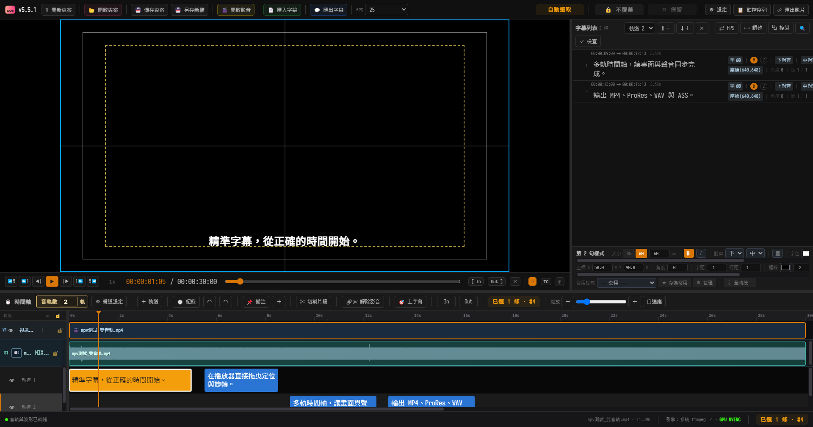

<p align="center">
  
</p>

<h1 align="center">SUB Tool</h1>

<p align="center">
  <strong>把字幕、畫面、音訊與交付，放在同一條時間軸完成。</strong><br>
  為上字幕、剪輯與交付流程打造的多軌時間軸工具，提供網頁版與 Windows 桌面版。
</p>

<p align="center">
  <a href="https://github.com/evanwayc-star/SUB_Tool/releases/latest">下載 Windows 桌面版</a>
  &nbsp;·&nbsp;
  <a href="docs/使用說明.md">閱讀使用說明</a>
  &nbsp;·&nbsp;
  <a href="docs/版本變更紀錄.md">查看版本變更</a>
</p>



> 以上為示範素材畫面：播放器可直接調整字幕，右側處理逐句樣式，下方用多軌時間軸安排畫面、音訊與字幕。

## 從素材到交付，一條時間軸完成

| 1. 匯入 | 2. 編輯 | 3. 交付 |
| --- | --- | --- |
| 影片、圖片、音訊與 SRT／ASS 字幕 | 在播放器和多軌時間軸同步調整 | 輸出 MP4、ProRes、WAV 與交付字幕檔 |
| 桌面版支援 MXF、MKV、AVI 與多音軌媒體 | 字幕、畫面片段、外部音訊可獨立編輯 | 輸出範圍、FPS、時間碼與佇列都可掌握 |

## 為交付而設計

### 精準處理字幕

- 在播放器上直接拖曳字幕定位、旋轉；可開啟安全框與時間碼監看。
- 每一句都能覆蓋字型、字級、位置、對齊、顏色、框線、陰影、字距、行距與直書設定。
- 匯入／匯出 SRT、ASS／SSA、Adobe Encore 時碼、純文字與 XLSX；預覽、mpv 與燒錄匯出共用同一套樣式。

### 多軌處理畫面與聲音

- 多條字幕、視訊與音訊軌道可同時排列；支援切割、修剪、疊層、子母畫面、圖片素材、淡入淡出與軌間溶接。
- 專案音訊路由以輸出 Bus 為核心，可安排 Mono、Stereo、5.1 與多聲道 WAV 的來源聲道對應。
- 交付時一律使用母素材解碼，不會把 Proxy 或播放快取當成正式輸出來源。


> 佇列畫面以示範工作呈現：每筆工作都能看到輸出時長、處理狀態、進度、預估時間與完成時間，也可暫停、排序或清除紀錄。

## 選擇適合的版本

| 版本 | 適合情境 | 媒體能力 |
| --- | --- | --- |
| **Windows 桌面版（推薦）** | 日常剪輯、交付與開啟 `.subtool` 專案 | MP4、MOV、MXF、MKV、AVI、多音軌、mpv 秒開與媒體快取 |
| 網頁版 | 輕量編輯或從原始碼啟動 | MP4、MOV（H.264）、MP3、WAV |

## 快速開始

### 使用 Windows 桌面版

1. 前往 [Releases](https://github.com/evanwayc-star/SUB_Tool/releases/latest) 下載並安裝最新版。
2. 開啟 SUB Tool，匯入媒體和字幕；已有專案可直接雙擊 `.subtool` 檔案。
3. 需要逐步操作時，從 [`docs/使用說明.md`](docs/使用說明.md) 開始。

<details>
<summary>從原始碼執行（開發者）</summary>

需要 [Node.js](https://nodejs.org) 18+。第一次安裝依賴後，以 Electron 啟動桌面版：

```bash
npm install
npm run electron
```

只要建立網頁版成品時執行：

```bash
npm run build
```

完整開發、驗證與發版指令見 [`docs/開發與驗證.md`](docs/開發與驗證.md)。

</details>

## 文件入口

| 你想做什麼 | 從這裡開始 |
| --- | --- |
| 學會操作、快捷鍵與字幕格式 | [`docs/使用說明.md`](docs/使用說明.md) |
| 建置、測試或發版 | [`docs/開發與驗證.md`](docs/開發與驗證.md) |
| 了解 Electron、ffmpeg、mpv 與 IPC | [`docs/Electron_維護手冊.md`](docs/Electron_維護手冊.md) |
| 了解資料流、字幕樣式與技術不變量 | [`docs/技術架構說明.md`](docs/技術架構說明.md) |
| 查閱 FPS／時間碼規則 | [`docs/FPS_時碼一致性.md`](docs/FPS_時碼一致性.md) |
| 追蹤每一版修正與驗證紀錄 | [`docs/版本變更紀錄.md`](docs/版本變更紀錄.md) |

> 維護者與 AI 助理請先閱讀 [`AGENTS.md`](AGENTS.md)，再查看技術架構與驗證文件。
