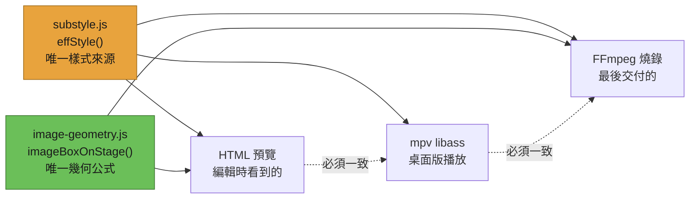

<p align="center">
  
</p>

<h1 align="center">SUB Tool</h1>

<p align="center">
  <strong>把字幕、畫面、音訊與交付，放在同一條時間軸完成。</strong><br>
  Arctime 風格的多軌上字幕工具　·　網頁版隨開隨用，Windows 桌面版吃得下 44GB 的 MXF，Apple Silicon 測試版可自行建置。
</p>

<p align="center">
  <a href="https://github.com/evanwayc-star/SUB_Tool/releases/latest"></a>
  
  
  
</p>

<p align="center">
  <a href="https://github.com/evanwayc-star/SUB_Tool/releases/latest"><b>⬇ 下載桌面版</b></a>
  &nbsp;·&nbsp;
  <a href="docs/使用說明.md">📖 使用說明</a>
  &nbsp;·&nbsp;
  <a href="docs/版本變更紀錄.md">🗒 版本變更</a>
  &nbsp;·&nbsp;
  <a href="AGENTS.md">🤖 給 AI 助理</a>
</p>

---

## 這是什麼

一個把**上字幕**和**剪輯交付**放在同一條時間軸上的工具。你可以在這裡切片段、疊圖層、
配聲道、逐句調字幕樣式，最後一次送出多種交付格式，轉檔在背景跑，你繼續編輯。


<p align="center"><sub>
主工作區。上方是即時預覽（字幕直接畫在畫面上，可拖曳定位），右側是字幕列表與逐句樣式面板，
下方是多軌時間軸：<b>V2</b> 疊層圖片、<b>V1</b> 主影片、<b>S1</b> 音訊波形，再往下是兩條字幕軌
（第二條帶 🔒 表示已鎖定）。
</sub></p>

---

## ✨ 主要能力

### 🎬 多軌時間軸：不只是字幕，是完整的影音畫布

| 能力 | 說明 |
| :--- | :--- |
| **無限視訊／字幕軌** | 拖曳邊緣修剪，拖放換軌；視訊軌可一鍵收合，把畫面留給字幕 |
| **疊層與子母畫面** | 透明疊層、PiP、插入圖片，逐片段獨立控制大小與位置 |
| **轉場** | 內建淡入淡出，相鄰片段可交叉溶接 |
| **影音合一軌** | 區塊內直接顯示波形，列頭就是混音器 |

### 📐 圖片與影片都能逐片段調整（v5.8.0）

右鍵任何一個圖片或影片片段，就能改它的**大小、位置**與**播放長度**——
不影響同軌其他片段，也不動它的起點。


<p align="center"><sub>
「符合視窗」會維持目前的中心位置，等比例放大到上下左右<b>最先碰到</b>的那個邊界為止。
按「取消」（或 <kbd>Esc</kbd>、點視窗外）會還原成打開對話框前的樣子。
</sub></p>

### 📝 專業且細膩的字幕控制

- **逐句樣式**：字型、字級、對齊、外框、陰影、直書、旋轉，可以只改選中的那一句。
- **所見即所得**：在預覽畫面上直接拖曳字幕定位。
- **格式齊全**：SRT、ASS/SSA、純文字、xlsx，以及 Adobe Encore 時碼，匯入匯出都支援。
- **合併匯出**：勾選多條軌道，一次併成單一 SRT／ASS。
- **軌道鎖定真的鎖得住**：鎖定後在上字幕模式按 <kbd>I</kbd>／<kbd>O</kbd> 會被擋下並提示，
  不會靜悄悄地改到（這是 v5.8.0 修掉的一個坑）。

### 🔊 為交付而生的音訊處理

- **多聲道路由**：內建配線矩陣（Bus），Mono／Stereo／5.1 的輸出對應都在同一個面板決定。
- **原生畫質交付**：輸出一律回頭讀母素材重新編碼，不會拿預覽用的 Proxy 或快取充數。
- **音訊三層分離**：素材聲道、專案 bus、匯出聲道是三件獨立的事，不會互相污染。

### 🚚 背景交付佇列

一次列好多筆交付（不同格式、不同解析度、要不要燒時間碼），一次送出。


<p align="center"><sub>
交付清單。同一份時間軸可以同時輸出 MP4、ProRes 與純音訊 WAV，每一列各自決定解析度、
碼率、聲道配置，以及要不要把時間碼燒進畫面。同目錄內出現重複檔名會當場擋下。
</sub></p>

送出後轉檔在背景排隊進行，可以隨時看進度與預估剩餘時間、拖曳調整等待中的順序、
暫停整條佇列——**編輯不必停下來等**。


> 關掉軟體時如果還有工作在轉，不會默默中斷，會先問你（v5.7.0）。
> 已完成的紀錄跨重啟保留。

---

## 🧭 一份樣式，三個地方長得一樣

這是整個專案最核心的一條規矩：**HTML 預覽、mpv 播放、燒錄匯出**這三條路，
只准吃同一份樣式計算結果。任何一條自己算，畫面看起來會正常，匯出卻是錯的。



> v5.8.0 就是靠三路逐像素比對，才抓到一個長期存在的落差：素材比例與專案不同、
> 且該軌是 PiP 時，預覽與匯出實測差 **120px**。細節見
> [`docs/技術架構說明.md`](docs/技術架構說明.md) §0。

---

## 💻 選哪個版本

| | 🖥 **Windows 桌面版**（推薦） | 🍎 **Apple Silicon 測試版** | 🌐 **網頁版** |
| :--- | :--- | :--- | :--- |
| **適合** | 日常剪輯、高強度交付、`.subtool` 專案檔 | M 系列 Mac 本機驗收；目前需從原始碼建置 | 快速預覽、跨平台、從原始碼跑 |
| **影片格式** | MP4 · MOV · **MXF** · MKV · AVI | MP4 多聲道已實機驗證；MOV／MXF／MKV／AVI 仍依 §4.16 驗收 | MP4 · MOV (H.264) |
| **音訊** | 多音軌素材、多聲道輸出 | `5.1 FM + 2.0 FM` 已實機驗證為 8 個獨立 Mono | 基本播放 |
| **播放核心** | 內建 `mpv`，44GB 大檔秒開 | ffmpeg ingest + HTML/WebCodecs；第一版不啟用 mpv | 瀏覽器 HTML5 |
| **轉檔** | 內建 `FFmpeg`，背景佇列 | 內建 arm64 FFmpeg；VideoToolbox 已實機驗證，CPU fallback 保留 | 瀏覽器端，能力有限 |

---

## ⚡ 快速開始

### 一般使用者（Windows）

1. 到 [**Releases**](https://github.com/evanwayc-star/SUB_Tool/releases/latest) 下載
   `SUB Tool Setup X.Y.Z.exe` 並安裝。
2. 開啟後把影片與字幕檔**直接拖進畫面**。
3. 已存過的 `.subtool` 專案檔**雙擊就能還原**所有軌道與設定。
4. 第一次用，建議先翻一下 [`docs/使用說明.md`](docs/使用說明.md)。

<details>
<summary><b>👩‍💻 從原始碼執行（開發者）</b></summary>

<br>

需要 [Node.js](https://nodejs.org) 18+。本專案是 **Vite + 原生 ES 模組（無框架）**，
以 `vite-plugin-singlefile` 打包成單一 `dist/index.html`。

安裝依賴：

```bash
npm install
```

啟動開發用桌面版：

```bash
npm run electron
```

只編譯網頁版前端：

```bash
npm run build
```

Windows 編譯並打包出 `.exe` 安裝檔：

```bash
npm run dist
```

Apple Silicon Mac 編譯 unsigned 本機測試版（DMG + ZIP）：

```bash
npm ci
npm run dist:mac:test
```

這不是已簽署的公開發行版。Apple Silicon 的 6.42GB `5.1 FM + 2.0 FM`／8 Mono／MP4 交付
已完成實機驗證；完整的 Gatekeeper 放行方式、原生架構核對與仍待執行的 44GB MXF／交付
清單見 [`docs/開發與驗證.md`](docs/開發與驗證.md#apple-silicon-本機測試版)。

三道靜態安全網（發版前必須全綠）：

```bash
npm run lint && npm test && npm run build
```

完整的環境需求、驗證方法與發版流程見 [`docs/開發與驗證.md`](docs/開發與驗證.md)。

</details>

---

## 🗂 專案結構

```
src/            renderer ES 模組與 WebCodecs 實作
electron/       Electron 主行程、preload、mpv／ffmpeg adapters
shared/         renderer／主行程共用的零相依 CommonJS 領域規則
scripts/        acceptance／diagnostics／release 工具
tests/          vitest 行為、契約與結構測試
docs/           使用、開發、架構與 ADR 文件
font/<資料夾名>/ 自備字型；資料夾名就是 UI 顯示名
```

架構規則：**沒有任何模組可以 `import … from './app.js'`。**
低階模組要觸發重繪或指令時發事件（`emit()`），由 `app.js` 或專責的上層 bridge／view 訂閱。
檔案放置與命名規則見 [`docs/開發與驗證.md` §6](docs/開發與驗證.md#6-目錄結構與命名)。

---

## 📚 文件索引

| 你想做什麼 | 看這份 |
| :--- | :--- |
| 學操作與快捷鍵 | [`docs/使用說明.md`](docs/使用說明.md) |
| 建置、驗證、發版 | [`docs/開發與驗證.md`](docs/開發與驗證.md) |
| 了解核心鐵律與模組架構 | [`docs/技術架構說明.md`](docs/技術架構說明.md) |
| 了解 Electron 與 IPC | [`docs/Electron_維護手冊.md`](docs/Electron_維護手冊.md) |
| 了解 FPS 與時間碼邏輯 | [`docs/FPS_時碼一致性.md`](docs/FPS_時碼一致性.md) |
| 查每一版修了哪些坑 | [`docs/版本變更紀錄.md`](docs/版本變更紀錄.md) |
| 查某個詞在這裡指什麼 | [`CONTEXT.md`](CONTEXT.md)（領域詞彙表） |
| 查某個設計為什麼這樣決定 | [`docs/adr/`](docs/adr/)（架構決策紀錄） |

---

> 🤖 **給 AI 助理與新加入的維護者**
>
> 動手改任何程式碼之前，請**務必**先讀 [`AGENTS.md`](AGENTS.md)——
> 那是本專案的最高指導原則，每一條規則後面都對應一次真實踩過的坑。
