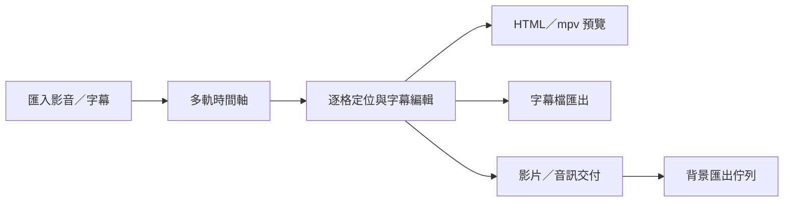
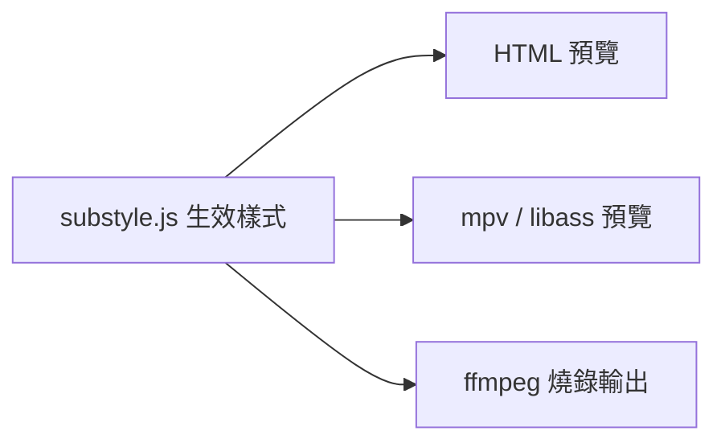

# SUB Tool

一套以「精準時間軸」為核心的桌面字幕工具。字幕、影片、圖片與多軌音訊可在同一個工作區完成，並以 ffmpeg 產出交付檔。

[下載最新 Windows 安裝版](https://github.com/evanwayc-star/SUB_Tool/releases/latest) · [完整使用說明](docs/使用說明.md) · [開發與驗證](docs/開發與驗證.md)


## 適合做什麼

- 以左右鍵穩定逐格，使用 J／K／L 倒帶、暫停與快轉。
- 在多軌時間軸剪輯 MOV、MXF、MP4、圖片、音訊與字幕。
- 為每句字幕調整內容、In／Out、位置、旋轉、字型與樣式。
- 鎖定視訊、音訊或字幕軌，避免誤改；鎖定軌仍可點擊或拖曳播放點。
- 以本機 Whisper 或雲端服務執行語音辨識與逐行文本匹配。
- 一次建立多份 MP4、ProRes、WAV 交付，交由背景佇列執行。

## 工作方式



字幕樣式只由一份規則產生：



## 核心功能

### 精準播放

- 支援 23.976、24、25、29.97 DF／NDF、30 fps。
- 左右鍵逐格；按住可連續逐格。
- J／K／L 穿梭，最高 5×；長 GOP 素材會使用短 GOP 預覽 Proxy 改善倒帶。
- 點擊或拖曳時間尺、波形與鎖定軌都能移動播放點。
- 播放器雙擊切換全螢幕，再雙擊或按 Esc 返回。

### 多軌編輯

- 多視訊軌、圖片疊層、淡入淡出、透明度、PiP 與片段修剪。
- 多字幕軌、逐句樣式、多選、跨軌移動、檢查與比較。
- 多音訊來源與專案音軌路由，支援 M／S／音量與輸出聲道編組。
- 鎖定軌內的素材不可選取或修改；原有選取不會因誤點鎖定軌而消失。

### 語音辨識與文本匹配


- 語音辨識：由聲音建立文字與時間碼。
- 文本匹配：保留已校對的逐行原稿，只分析各行時間。
- 可選全部來源聲道混音或指定來源聲道。
- 支援程式內建本機 AI、Groq、OpenAI、Azure Speech、Google Gemini（優先採用 2.5／2.0 Flash）與 ElevenLabs，並相容本機自建之 OpenAI 格式端點。

### 背景交付


- MP4 H.264、MOV ProRes、WAV 與字幕檔。
- 多份交付可一起送出；工作送出後使用凍結快照，不受後續編輯影響。
- 佇列支援並行、停止、重試、排序、崩潰復原與同一路徑互斥。
- 影片匯出永遠讀母素材；Proxy 只用於預覽。

## 平台

| 平台 | 狀態 | 說明 |
|---|---|---|
| Windows 10／11 x64 | 正式支援 | 安裝包內含 ffmpeg、ffprobe 與 mpv；MXF、多聲道、大檔與正式交付都以此版驗收 |
| Apple Silicon | 本機 unsigned 測試 | 可產生 arm64 DMG／ZIP；尚未完成 Developer ID、notarization 與實體 Mac 正式驗收 |
| 網頁版 | 輕量使用 | 適合瀏覽器原生格式；MXF、多音軌與大型專案建議使用桌面版 |

## 快速開始

一般 Windows 使用者：

1. 到 [Releases](https://github.com/evanwayc-star/SUB_Tool/releases/latest) 下載 Setup。
2. 安裝後開啟 SUB Tool。
3. 拖入影音，或按「開啟影音」。
4. 用左右鍵逐格、I／O 設定字幕時間。
5. 儲存 `.subtool` 專案，再匯出字幕或交付影片。

從原始碼執行：

```bash
npm ci
npm run electron
```

開發模式：

```bash
npm run dev
npm run electron:dev
```

## 文件

| 文件 | 內容 |
|---|---|
| [使用說明](docs/使用說明.md) | 安裝、介面、完整操作與快捷鍵 |
| [開發與驗證](docs/開發與驗證.md) | 指令、測試、真機驗收、打包與發版 |
| [技術架構說明](docs/技術架構說明.md) | 不變量、模組邊界與資料流 |
| [Electron 維護手冊](docs/Electron_維護手冊.md) | IPC、檔案權限、ffmpeg、mpv 與佇列 |
| [FPS／時碼一致性](docs/FPS_時碼一致性.md) | seek、逐格、DF／NDF 與時間域規則 |
| [領域詞彙表](CONTEXT.md) | 專案統一用語 |
| [版本變更紀錄](docs/版本變更紀錄.md) | 歷史版本與驗證證據 |
| [架構決策](docs/adr/) | 已採用的架構決策與代價 |

## 專案結構

```text
src/       renderer、時間軸、字幕、播放與 WebCodecs
electron/  主行程、IPC、ffmpeg、mpv、檔案能力與匯出佇列
shared/    renderer 與主行程共用的零相依純規則
scripts/   CI、真機驗收、診斷與發版工具
tests/     Vitest 行為、契約與結構測試
docs/      使用、開發與維護文件
font/      隨程式攜帶的自備字型
```

授權：ISC。
