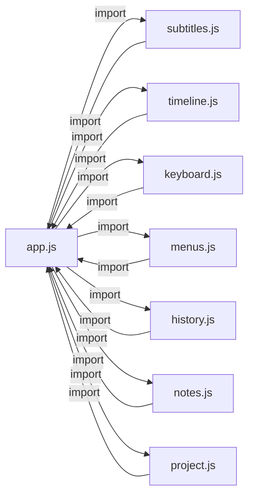

# SUB_Tool 完整程式碼優化審查報告

以下基於對 **17 個原始碼檔案** 的逐行審查，歸納出六大面向的優化機會。  
目前 **未修改任何程式碼**，僅列出問題與建議。

---

## 一、效能瓶頸 (Performance)

### 1.1 rafLoop 中的 O(N) 線性搜尋
[app.js:291](file:///c:/Users/Evan/Desktop/SUB_Tool/src/app.js#L291)

```js
const act = State.cues.find(c => c.timed!==false && (t+0.001)>=c.start && (t+0.001)<=c.end);
```

每秒 60 次 `Array.find()` 遍歷所有字幕。1000 條字幕時每秒執行 60,000 次比較。

**💡 建議**：維護一個 `_lastActiveIdx` 游標，每幀只檢查前後 2～3 條，O(1) 即可命中。

---

### 1.2 renderSubList 全量重建 DOM
[subtitles.js:139-158](file:///c:/Users/Evan/Desktop/SUB_Tool/src/subtitles.js#L139-L158)

每次 `renderAll()` 都清空 `sublist.innerHTML=''` 後重新建立所有 `.sub-row`。每個 row 掛載 7+ 個事件監聽器 (mousedown, dblclick, contextmenu, input, blur, keydown…)。

> [!WARNING]
> 1000 條字幕 → 一次 renderAll 要建立 7000+ 個 event listener，舊的被 GC 回收前會短暫佔用記憶體。

**💡 建議**：
- **短期**：改用**事件代理 (Event Delegation)**，在 `#sublist` 上統一監聽 `mousedown / dblclick / contextmenu`，透過 `e.target.closest('.sub-row')` 定位。
- **中期**：導入**虛擬列表 (Virtual Scroll)**，只渲染可視區域的 ~30 列。

---

### 1.3 renderCueBlocks 全量重建
[timeline.js:275-308](file:///c:/Users/Evan/Desktop/SUB_Tool/src/timeline.js#L275-L308)

每次重繪先 `querySelectorAll('.cue-block,.cue-overlap').forEach(e=>e.remove())`，再逐一 `createElement`。拖曳移動字幕時也會被觸發 ([timeline.js:506](file:///c:/Users/Evan/Desktop/SUB_Tool/src/timeline.js#L506))，導致拖曳卡頓。

**💡 建議**：拖曳期間只更新被拖曳區塊的 `style.left/width`，結束時再全量重繪。

---

### 1.4 重疊偵測的 O(N²) 迴圈
[subtitles.js:148-152](file:///c:/Users/Evan/Desktop/SUB_Tool/src/subtitles.js#L148-L152) 和 [subtitles.js:99-101](file:///c:/Users/Evan/Desktop/SUB_Tool/src/subtitles.js#L99-L101)

```js
for(let i=0;i<timed.length;i++)
  for(let j=i+1;j<timed.length;j++)
```

1000 條字幕 = ~500,000 次比較。`renderCheckPanel` 和 `renderSubList` 各有一份獨立的重疊偵測。

**💡 建議**：先按 `start` 排序，再只比較相鄰區間 → O(N log N)。同時將邏輯抽出為共用函式，避免重複程式碼。

---

### 1.5 `tlTotal()` 中的 `Math.max(...State.cues.map(c=>c.end))`
[timeline.js:26](file:///c:/Users/Evan/Desktop/SUB_Tool/src/timeline.js#L26)

每次呼叫 `layoutTimeline()` 都會展開所有 cue 的 end 值做 `Math.max`。如果 cues 數量超過 ~60,000，會因 stack overflow 而崩潰 (`Maximum call stack size exceeded`)。

**💡 建議**：改用 `reduce` 或 for 迴圈取最大值。

---

## 二、潛在 Bug 與邏輯問題

### 2.1 seek 方法的參數遮蔽 (Variable Shadowing)
[media.js:684](file:///c:/Users/Evan/Desktop/SUB_Tool/src/media.js#L684)

```js
if(this.playing && this.tracks.some(t => t.kind==='buffer')){
  this.stopBufferSources(); this.startBufferSources(t);
}
```

外層的 `t`（seek 目標時間）被 `.some(t=>...)` 的箭頭函式參數 `t` 遮蔽了。如果 `.some()` 的結果為 true，`startBufferSources(t)` 拿到的 `t` 是最後一個 track 物件而非目標秒數。

> [!CAUTION]
> 這是一個**實際 Bug**：在有 buffer 音軌的情況下 seek 可能導致音訊從錯誤時間點開始播放。

**💡 修復**：將 `.some(t=>...)` 的參數改名為 `tr`。

---

### 2.2 Undo/Redo 使用 JSON.stringify 深拷貝
[history.js:12](file:///c:/Users/Evan/Desktop/SUB_Tool/src/history.js#L12)

```js
snap(){ return JSON.stringify({cues:State.cues, tracks:State.tracks, notes:State.notes, ...}); }
```

每次 `recordHistory()` 都 JSON 序列化整個 cues 陣列。1000 條字幕 × 120 快照 = 大量字串記憶體。

**💡 建議**：
- 改用 `structuredClone()` + 差異壓縮 (只存變動的 cue)
- 或對超過 60 條的快照做去重（只存有差異的部分）

---

### 2.3 encodeUTF16LE 不支援 Surrogate Pair
[util.js:22-27](file:///c:/Users/Evan/Desktop/SUB_Tool/src/util.js#L22-L27)

```js
for(let i=0;i<str.length;i++){
  const c=str.charCodeAt(i);
  out[2+i*2]=c&0xFF; out[3+i*2]=(c>>8)&0xFF;
}
```

`charCodeAt()` 遇到 emoji（如 🎬）會回傳 surrogate 的高/低位元各一次，而 `str.length` 會把一個 emoji 算成 2。理論上 UTF-16 LE 就是存 surrogate pair，但 `new Uint8Array(2+str.length*2)` 的長度計算 **是正確的**，只是程式碼閱讀上容易誤解。

**💡 建議**：加上註解說明此函式已正確處理 surrogate pair（因為 charCodeAt 本身就回傳 16-bit code unit）。

---

### 2.4 `downloadBytes` 未考慮 iOS Safari 限制
[util.js:28-33](file:///c:/Users/Evan/Desktop/SUB_Tool/src/util.js#L28-L33)

使用 `<a>.click()` 下載檔案，在 iOS Safari 可能不觸發下載。

**💡 建議**：桌面版可直接使用 Electron API 寫檔；網頁版可考慮加上 `window.open(url)` 的 fallback。

---

## 三、架構與耦合 (Architecture)

### 3.1 循環依賴鏈


**所有模組都與 `app.js` 形成雙向依賴**。目前靠 Vite/ESM 的延遲求值來避免初始化時的循環錯誤，但一旦某個模組在 top-level 立即使用 import 值，就會拿到 `undefined`。

**💡 建議**：
- 抽出一個 `events.js` (EventEmitter)，各模組只發送事件，由 `app.js` 監聽並呼叫對應渲染函式。
- 或者將 `renderAll`、`renderVideoSub` 等函式移到一個 `render.js` 統一管理。

---

### 3.2 `app.js` 過於龐大（1319 行 / 74KB）

包含了：匯入/匯出邏輯、UI 接線、混音器渲染、FPS 轉換對話框、快取管理、拖曳分隔線、字幕編輯彈窗…

**💡 建議**：可拆分為：
- `mixer.js` — 混音器渲染與電平表
- `import-export.js` — 字幕匯入匯出對話框
- `ui-layout.js` — 分隔線拖曳與面板切換
- `dialogs.js` — FPS 轉換、快取管理等 Modal

---

## 四、記憶體管理 (Memory)

### 4.1 外部音檔的整檔解碼
[media.js:321-330](file:///c:/Users/Evan/Desktop/SUB_Tool/src/media.js#L321-L330)

`addAudioFileDesktop` 透過 `DESK.waveAudio()` 取得 base64 WAV → `decodeAudioData()` 全部讀入記憶體。一個 2 小時的立體聲 48kHz WAV ≈ 1.3GB 的 Float32Array。

> [!WARNING]
> 即使在桌面版（Electron），也可能因為 V8 記憶體限制而 OOM 崩潰。

**💡 建議**：在 Electron `main.js` 中用 ffmpeg 直接輸出峰值 JSON（例如 `audiowaveform` 格式），前端只收 peaks 陣列 (~幾 MB)。

---

### 4.2 ObjectURL 清理時機
[media.js:777](file:///c:/Users/Evan/Desktop/SUB_Tool/src/media.js#L777)

`reset()` 會批次 `revokeObjectURL`，但如果使用者多次載入又取消，中途的 ObjectURL 會一直累積到下次 reset。

**💡 建議**：每次 `loadVideoFile` / `addAudioFile` 前，先 revoke 上一次的 ObjectURL。

---

### 4.3 ffmpeg.wasm 整檔讀入記憶體
[media.js:528](file:///c:/Users/Evan/Desktop/SUB_Tool/src/media.js#L528)

```js
const data = new Uint8Array(await readFile(file));
ff.FS('writeFile','in.media',data);
```

影片檔案被完整讀入 `Uint8Array`，再寫入 ffmpeg 的虛擬 FS，記憶體佔用 ≈ 2× 檔案大小。

**💡 建議**：`FFMPEG_MAX_BYTES = 1.6GB` 已設上限，但仍可能導致 1.6GB × 2 = 3.2GB 瞬間峰值。桌面版應完全不走 ffmpeg.wasm 路徑。

---

## 五、CSS / HTML 優化

### 5.1 缺少 `will-change` 提示
波形 canvas (`#waveCanvas`) 和播放頭 (`#tlPlayhead`) 每幀都在更新位置，但沒有 `will-change: transform` 提示，瀏覽器可能每次都重繪完整圖層。

**💡 建議**：
```css
#tlPlayhead { will-change: left; }
#waveCanvas { will-change: contents; }
```

---

### 5.2 CSS 中的內嵌 SVG 在每次渲染時被重新解析
[timeline.js:123](file:///c:/Users/Evan/Desktop/SUB_Tool/src/timeline.js#L123)

隱藏眼睛圖標使用了一段內嵌 SVG 字串。每次 `renderTrackRows()` 都用 `innerHTML` 重新解析此 SVG。

**💡 建議**：將 SVG 提取為 `<template>` 或用 CSS `mask-image` 替代。

---

### 5.3 `index.html` 中的 hidden file input 可精簡
HTML 中有 3 個隱藏 `<input type="file">`（影音、音訊、專案），可合併為一個，透過動態設定 `accept` 屬性重用。

---

## 六、Electron 整合

### 6.1 mpv bounds 輪詢過於頻繁
[media.js:344](file:///c:/Users/Evan/Desktop/SUB_Tool/src/media.js#L344)

```js
this._mpvBoundsTimer = setInterval(send, 500);
```

每 500ms 透過 IPC 傳送一次 bounds 給 mpv 子程序。已有 `ResizeObserver` 監聽視窗大小變化，`setInterval` 只作為安全網。

**💡 建議**：將 interval 放寬至 2000ms 或只在特定操作（面板切換/分隔線拖曳）時才補發一次。

---

### 6.2 `preload.js` 暴露的 API 未做輸入驗證

`contextBridge.exposeInMainWorld` 直接將 IPC 方法暴露給渲染進程，未檢查參數型別。惡意或錯誤的呼叫可能導致 main process 崩潰。

**💡 建議**：在 `preload.js` 中加上基本的型別檢查（特別是檔案路徑參數）。

---

## 優先度建議

| 優先度 | 項目 | 影響 |
|:---:|------|------|
| 🔴 | 2.1 seek 參數遮蔽 Bug | 音訊播放錯位 |
| 🟠 | 1.1 rafLoop O(N) 搜尋 | 大量字幕時 CPU 浪費 |
| 🟠 | 1.2 renderSubList 全量重建 | 操作卡頓 |
| 🟠 | 1.4 重疊偵測 O(N²) | 大量字幕時明顯延遲 |
| 🟡 | 4.1 音檔整檔解碼 | 長音檔 OOM 風險 |
| 🟡 | 3.1 循環依賴 | 維護性降低 |
| 🟢 | 1.5 Math.max 展開 | 極端數量才會崩潰 |
| 🟢 | 5.1 will-change 提示 | 微小效能提升 |
| 🟢 | 6.1 mpv bounds 輪詢 | 減少 IPC 開銷 |

---

> [!NOTE]
> 以上所有項目都附上了具體的檔案位置與行號，您可以直接點擊連結跳到對應的程式碼。如果您決定要修復或優化任何一項，請告訴我想從哪裡開始！
