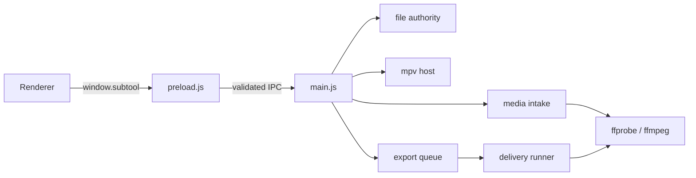
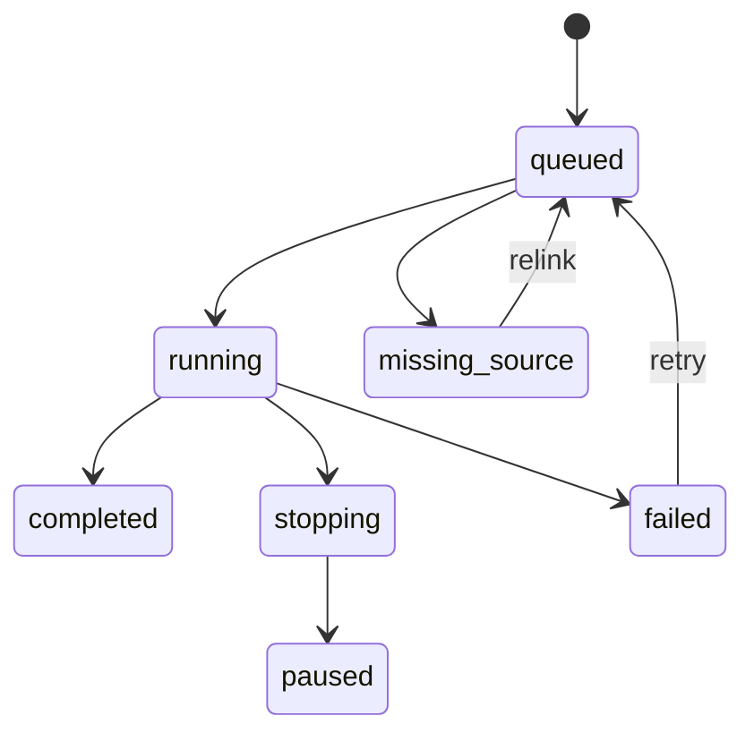

# SUB Tool Electron 維護手冊

這份文件只談桌面邊界：視窗、preload、IPC、檔案能力、ffmpeg、mpv、匯出佇列與封裝。Renderer 架構見 [技術架構說明](技術架構說明.md)。

## 1. 系統總覽



| 模組 | 唯一責任 |
|---|---|
| `electron/main.js` | BrowserWindow、IPC 註冊與 adapter 組裝 |
| `electron/preload.js` | contextBridge 與 renderer 輸入型別守門 |
| `electron/local-resource.js` | `subtool-local:` capability URL |
| `electron/file-authority.js` | 精確 read／write／project／screenshot／delivery 權限 |
| `electron/trusted-project-intake.js` | 由可信 `.subtool` bytes 衍生媒體能力 |
| `electron/project-write-admission.js` | Save As／覆寫專案的原子寫入 |
| `electron/media-intake-runtime.js` | probe、Proxy、波形、聲道快取與 lease |
| `electron/native-tooling.js` | ffmpeg／ffprobe 路徑與 encoder 能力 |
| `electron/mpv-host.js` | Windows mpv 視窗、IPC 與精準畫格呈現 |
| `electron/export-queue.js` | 背景排程、並行、停止、重試與持久化 |
| `electron/delivery-runner.js` | 單一交付工作的 ffmpeg 交易 |
| `electron/export-watchdog.js` | ffmpeg 子程序與 owner process 崩潰隔離 |

`main.js` 可以組裝，不應重新實作各 owner 已擁有的規則。

## 2. 安全與檔案能力

主視窗設定：

```js
contextIsolation: true
nodeIntegration: false
webSecurity: true
```

Renderer 沒有 Node.js，也不能用任意路徑字串要求 main 讀寫檔案。

### 拖放

- Preload 用 `webUtils.getPathForFile()` 從真實 File 取得路徑。
- 一般媒體交給 `fs:authorizeDroppedFile`，只授權精確來源。
- `.subtool`／`.json` 不走一般檔案授權，直接進 `trusted-project-intake`。
- Renderer 自己提供的 path／base64 不可把能力擴張到其他檔案。

### 專案

- 開啟專案：main 先讀可信 bytes，再授權專案內已宣告媒體。
- Save As：每個 media path 必須已具 read capability。
- 寫入成功後才更新 current project 與 relink 狀態。
- 最近開啟清單只接受索引，不讓 renderer 回傳任意路徑。

### 本機資源 URL

`file://` 不作為一般資源通道。`local-resource.js` 發出不透明 `subtool-local:` URL，並在每次請求時核對：

- capability token
- 精確資源
- 允許的 range
- 呼叫視窗
- 失效與釋放狀態

不要用關閉 `webSecurity` 解決本機字型或媒體載入。

## 3. Preload／IPC 介面

完整可呼叫 API 以 `electron/preload.js` 為唯一真相來源；文件只列分組，避免手抄每個函式後漂移。

| `window.subtool` 分組 | 用途 |
|---|---|
| `status`、`minimizeApp`、`closeApp` | App 狀態與生命週期 |
| `openMedia`、`openAudio`、`openProject` | 原生選檔 |
| `saveProject`、`importSub`、`exportSub` | 專案與字幕對話框 |
| `recentProjects*` | 最近專案 |
| `authorizeDroppedFile`、`openDroppedProject` | 拖放准入 |
| `fileURL`、`stat`、`listDir`、`readB64` | 受權檔案能力 |
| `probe`、`ingest`、`streamIngest` | 媒體 probe／ingest |
| `makeProxy`、`extractAudio`、`waveAudio` | 預覽快取 |
| `compressSpeechAudio` | 雲端辨識前的受限音訊壓縮 |
| `exportVideo`、`stopExport` | 提交／停止交付 |
| `openQueueMonitor`、`onQueueStatus` | 佇列監控 |
| `config*`、`keys*` | 偏好與快捷鍵 |
| `mpv.*` | Windows mpv adapter |

Preload 原則：

- 所有 path、ArrayBuffer、request id 與選項先做型別／大小檢查。
- Renderer callback 不直接取得 Electron event。
- 事件訂閱需要清理舊 listener，避免重複通知。
- 新 IPC 要同時補 main 白名單、preload guard、測試與本文件分組。

獨立視窗：

- `queue-preload.js` 只暴露 queue monitor 需要的命令。
- `compare-preload.js` 只暴露字幕比較同步命令。
- 不要為方便直接重用整份主 preload。

## 4. ffmpeg／ffprobe 整合

### Native tool 解析

`native-tooling.js` 依目前平台與架構選擇封裝工具；開發環境可回退到受控的專案／環境位置。正式安裝包不可依賴使用者 PATH。

Windows 封裝需要：

- `electron/ffmpeg/ffmpeg.exe`
- `electron/ffmpeg/ffprobe.exe`

macOS arm64 封裝需要：

- `electron/ffmpeg/darwin-arm64/ffmpeg`
- `electron/ffmpeg/darwin-arm64/ffprobe`

`scripts/release/verify-native-binaries.js` 在封裝前驗證存在、平台、架構與能力。

### 媒體 intake

`media-intake-runtime.js` 管理：

1. ffprobe metadata
2. 來源指紋
3. 720p 預覽 Proxy
4. 逐聲道音訊快取
5. 低取樣波形
6. 短 GOP 倒帶 Proxy
7. 串流 lease 與清理

快取只供預覽。交付 runner 會拒絕把 `.subtool_Cache`、Proxy 或 `ch_*.m4a` 當母素材。

### 交付

Renderer 提交凍結工作；`delivery-runner.js`：

1. 核對檔案能力與輸出 lease
2. probe 母素材
3. 由 `export-plan.js`／pipeline builder 建立 argv
4. 啟動 watchdog 與 ffmpeg
5. 解析 progress
6. probe 成品內容
7. 提交完成／錯誤
8. 清理 ASS、半成品與 lease

Windows filtergraph 路徑要跳脫兩層；ASS Fontname 必須是字型檔內部 family。

### Encoder

可用時優先硬體 H.264 encoder；實際採用者要出現在狀態與完成訊息。不能只因命令沒有報錯就宣稱使用 GPU。

## 5. mpv 嵌入整合（Windows）

mpv 不是 DOM 元素，而是獨立的 OS 子視窗。`mpv-host.js` 負責：

- 啟動 `mpv.exe` 與 named pipe JSON IPC
- 設定 bounds、可見度與 always-on-top 關係
- 載入母素材或倒帶 Proxy
- play、pause、rate、direction、mute
- 精準 `time-pos` setter
- 監聽 `time-pos`、`playback-restart` 與 property change
- 載入 live ASS
- 更新透明 guide 與監看 TC

### 精準呈現

`mpv:present` 接受來源時間與 tolerance。播放中的完成證據需要目標 `time-pos` 與同一請求的 `playback-restart` 配對；暫停精準定位則以 command ack 加命中目標的 `time-pos` 為準。

逐格使用 `time-pos` setter，不使用連續 `seek absolute`。後者會排隊等待舊畫面，快速左右鍵時容易讓最新目標多等數百毫秒。

只保留最新 pending 呈現；舊 request 完成後不可回寫播放點。

### Guide 與互動

透明 guide 視窗永久 `setIgnoreMouseEvents(true, { forward:true })`。字幕、圖片與播放點互動由主 renderer 的 DOM layer 處理。

mpv 蓋住 HTML 時，`_syncMpvPanel()` 依操作需要暫時隱藏或讓 WebCodecs 接管。不要新增第二套 guide pointer 命令。

### macOS

目前 Apple Silicon 測試包不含 mpv；`mpv.detect()` 必須回傳不支援，並自動使用 ffmpeg ingest／HTML／WebCodecs 路徑。

## 6. 匯出佇列

工作狀態：



主要保證：

- 一個工作使用送出當下的凍結快照。
- 同一路徑同時只允許一個 live job。
- `output-leases/*.lock/owner.json` 防止多程序寫同一檔案。
- watchdog 在 owner 崩潰時停止 ffmpeg。
- 重啟先復原 stale work、刪半成品、釋放 lease，再載入佇列。
- 完成紀錄保存在 `history.json`，重開不重跑。
- 有執行中工作時關閉主視窗，監控視窗接手；真正退出前再次確認。

`queue-store.js` 擁有 live state 持久化，`queue-history.js` 擁有完成紀錄。UI 不是真相來源。

## 7. 打包與發布

Windows：

```bash
npm run dist
```

`package.json` 重要設定：

- `asarUnpack`：mpv、ffmpeg、watchdog、lease
- `extraResources`：`font/`
- `perMachine: true`
- 桌面與開始功能表捷徑
- `.subtool` file association

正式驗收：

1. `npm run release:verify-source`
2. `verify-native-binaries.js`
3. 產生 Setup
4. 正常安裝到 Program Files
5. `npm run release:verify-install`
6. 驗證 App 內版本、捷徑、解除安裝與 file association
7. 比對 GitHub asset SHA-256

不要在專案根目錄跑 `asar extract-file`。需要檢查 asar 時，先建立獨立 temp 目錄，在該目錄解出並核對。

Apple Silicon：

```bash
npm run dist:mac:test
```

unsigned DMG／ZIP 只供內部驗收，不可當正式 Mac Release。

## 8. 排查

| 現象 | 先檢查 |
|---|---|
| App 開不起來 | native binaries、`shared/**/*` 是否進包、main console |
| 找不到 ffmpeg／mpv | `window.subtool.status()`、`mpv.detect()`、封裝路徑 |
| 媒體每次重轉 | 來源大小／前 1MB 指紋、cache metadata |
| MXF 畫面黑 | mpv launch／loadfile、Proxy 狀態、視窗 bounds |
| 左右鍵偶爾沒動 | present tolerance、舊 request 是否覆寫、mpv 是否仍用 seek command |
| 字幕位置三路不同 | `effStyle()`、PlayResY 高度縮放、ASS alignment |
| 字型 fallback | 內部 family、fontsdir 雙層跳脫、libass `fontselect` |
| 圖片框可見但不能拖 | guide 是否誤接滑鼠、`#imageLayer` 是否存在 |
| 鎖定軌會改掉選取 | pointer seek 與 selection 是否仍分離 |
| 匯出音訊不對 | 母素材、source→bus、bus→stream、ffprobe 成品 |
| 同路徑不能重試 | live job、stopping 狀態、stale output lease |
| 關閉後留下半成品 | watchdog log、owner.json、啟動復原 |
| 按鈕沒反應 | 是否誤用 `window.prompt()` |
| 本機資源被擋 | 不要關 webSecurity；檢查 `subtool-local:` capability |

問題回報至少附 main log、renderer console、素材 metadata、工作 id、輸出路徑與可重現時間碼。
