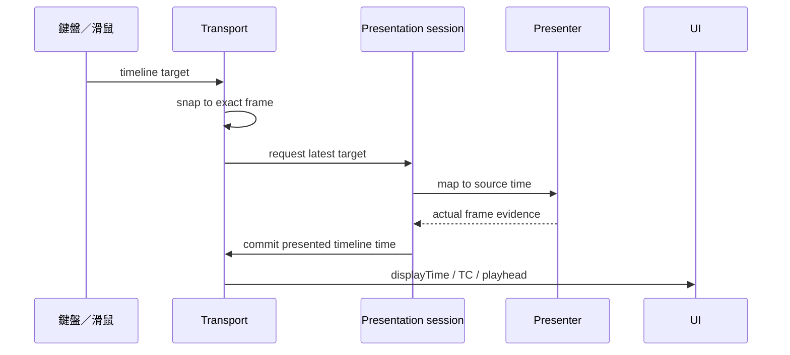

# FPS／時碼一致性

改 FPS、時碼、seek、播放點、逐格、倒帶或 presenter 前必讀。程式中的相關邊界以 `FPS-SYNC` 標記；用全域搜尋找目前位置，不手動維護數量。

## 1. 名詞

| 名詞 | 意義 |
|---|---|
| 牆鐘秒數 | 真實經過的浮點秒數 |
| 時碼 | `HH:MM:SS:FF`；29.97 DF 使用分號 |
| 影格格網 | 第 N 格位於 `N / exactFps` |
| 播放目標 | 使用者要求前往的位置，畫面尚未必抵達 |
| 呈現位置 | 播放器實際交出的可見畫格 |
| 時間軸時間 | UI、字幕、片段與交付共同座標 |
| 來源時間 | HTML video、mpv、WebCodecs 內部座標 |

29.97 NDF 是數影格，不是讓時碼貼近牆鐘；每小時會慢約 3.6 秒。要時碼接近牆鐘才用 29.97 DF。

## 2. 八條不變量

### I1. FPS 來自實測，不依檔名

- 桌面版：ffprobe `info.video.fps`。
- 網頁版：`requestVideoFrameCallback` 的實際 timestamp。
- 最後經 `snapFps()` 對齊 23.976、24、25、29.97、30。

不可先 `Math.round()`；否則 23.976 變 24、29.97 變 30。實際素材檔名可能同時寫 24FPS 與 30P，因此檔名只能當線索。

`getExactFps()` 的比對容差必須小於 0.024；目前 0.01。放寬到 0.05 會把 24 誤判為 24000/1001。

### I2. 秒轉時碼只有 encoreParts()

播放器、字幕列表、時間軸刻度、匯出與監看 TC 都由 `encoreParts()`／`secToEncore()` 產生。禁止在其他地方自行 `Math.floor` 拼字串。

### I3. 影格格網只有 snapTimeToFrame()

seek、pause、滑鼠拖曳、逐格、字幕時間與手勢交易都用 `snapTimeToFrame()`。

ASS 只有百分秒；`secToASS()` 直接表達原秒數，不預先減半格。SUB Tool 自產 ASS 的精確 frame metadata 負責往返還原。

### I4. 靜止讀數同源於 Media.displayTime()

`Media.displayTime()` 是 UI 權威位置：

- 暫停：已提交且吸附格網的呈現位置。
- 播放：播放器持續回報的時間軸位置。

播放器時碼、seek bar、時間軸播放點、備註與監看 TC 都讀它。不可直接讀 `video.currentTime`、mpv `time-pos` 或 event data。

播放目標不能冒充呈現位置。`requestPresentation()` 送出目標後，必須等待實際畫格證據：

- HTML video：`requestVideoFrameCallback().mediaTime`
- mpv 播放：目標 `time-pos` 與同一請求的 `playback-restart`
- mpv 暫停：command ack 加命中目標的 `time-pos`
- WebCodecs：所有可見層完成繪製後的來源 timestamp

### I5. 逐格以 displayTime() 為基準

`stepFrame()`／`nudge()` 從目前呈現格加減整數格，再交給 `Media.seek()`。

```text
targetFrame = presentedFrame + direction
targetTime  = targetFrame / exactFps
```

不能從帶浮點沉降的來源時間继续相加；那會造成右鍵跳兩格、左鍵不動。

逐格完成 tolerance 必須小於半格。一般 seek 的 1.5 格容差不能套到只差一格的操作，否則舊畫格也會被誤判為成功。

mpv 逐格使用 `time-pos` setter，不使用連續 `seek absolute`。快速連按時只保留最新 pending；舊畫格即使晚到，也不可覆寫權威位置。

### I6. 原始播放器時間不可覆寫暫停權威值

mpv 暫停時可能持續回報偏離格網的 `time-pos`：

- 與權威值差小於 1.5 格：視為沉降抖動，不覆寫。
- 明顯大幅變動：視為 mpv 內直接跳轉，吸附後提交。

### I7. 片段邊界永遠是時間軸時間

解除影音後，外部音訊有自己的 offset／in／out。鍵盤跳轉、切割、字幕、備註與匯出仍在時間軸域工作；只有音訊元素播放時轉成來源時間。

```text
sourceTime   = in + (timelineTime - offset)
timelineTime = offset + (sourceTime - in)
```

### I8. 監看 TC 與燒入 TC 分工

- 播放器 `TC`：讀 `Media.displayTime()`，只供監看。
- 交付「壓入時間碼」：從凍結工作的 `timelineStart` 起算。
- WAV 沒有畫面，不提供燒入 TC。

兩者都使用專案 FPS 與 DF／NDF，但不是同一個開關。

## 3. 呈現生命週期



同一 session：

- 同時最多一個 in-flight。
- 只保存最新 pending。
- newer intent 可在畫格到達前改成 play 或 pause。
- reset、換素材、換專案與 presenter takeover 會取消舊請求。
- 音訊 follower 只能在實際畫格提交後啟動或校正。

## 4. 關鍵 owner

| 模組 | 責任 |
|---|---|
| `time.js` | exact FPS、DF／NDF、時碼、frame snap |
| `timeline-transport.js` | 暫停權威時間與時間域轉換 |
| `media-presentation-core.js` | in-flight／pending／取消／commit |
| `media.js` | presenter 選擇、`displayTime()`、seek 與 audio lifecycle |
| `media-player-adapter.js` | HTML／mpv 共同操作 |
| `transport-controller.js` | 左右逐格、JKL、播放意圖 |
| `pointer-seek-control.js` | 滑鼠 jump／drag 與跳轉後播放政策 |
| `shuttle-runtime.js` | 反向穿梭目標與 cadence |
| `loaders/media-loader.js` | HTML／mpv 實際畫格回報 |
| `decode/player.js` | WebCodecs 多層繪製與 timestamp |
| `timeline-renderer.js` | 播放點與刻度 |
| `export-delivery-engine.js` | 凍結輸出起點與燒入 TC |

## 5. 常見失敗

### 時間軸刻度與播放器差幾秒

原因通常是其中一邊用牆鐘秒數手拼時碼。兩邊都改回 `encoreParts()`。

### 右鍵跳兩格、左鍵不動

原因通常是從原始 `currentTime` 或舊 request 計算下一格。以 `displayTime()` 為基準，並阻止舊呈現回寫。

### 按左右鍵但時間點沒有變

依序檢查：

1. tolerance 是否錯用一般 seek 的 1.5 格。
2. mpv 是否仍用 `seek absolute`。
3. 先前 in-flight 是否在較新目標後 commit。
4. 重複 keydown 是否從實際呈現格而非 pending 目標重算。
5. presenter 是否只回 IPC ack，卻沒有實際畫格證據。

### seek 後立刻播放看到舊畫面或音訊先跑

播放意圖可更新，但 presenter clock 與音訊不得在目標畫格到達前啟動。檢查 `playback-restart` 配對與 presentation session。

### 純字幕專案播放點變了，預覽沒變

無 HTML video／mpv 時仍要送統一 seeked／playhead invalidation，所有 consumer 再讀 `displayTime()`。

## 6. 驗證

純規則：

```bash
npm test -- tests/time.test.js
npm test -- tests/mediaPresentationCore.test.js
npm test -- tests/timelineTransport.test.js
npm test -- tests/transportController.test.js
```

真機：

```bash
npm run build
node scripts/acceptance/verify-transport-smoothness.js
node scripts/acceptance/verify-reverse-shuttle.js
```

實際素材：

- `V_MAMAMOO_FTR_24fps_51FM.mov`
- `V_拼桌_FTR_24FPS_51FM+20FM_30P.mxf`
- `V_心機特務_FTR.mp4`

至少測：

- 中段與尾段長距離 seek
- 暫停後單次左右格
- 快速交替左右格
- 按住方向鍵
- seek 後立刻播放／暫停
- J／K／L 與多倍率
- 停止倒帶後回母素材同一格
- 播放點、播放器 TC、實際畫面零持續漂移

新增時碼相關邊界時，補 `FPS-SYNC` 標記、測試與本文件 owner 表。
