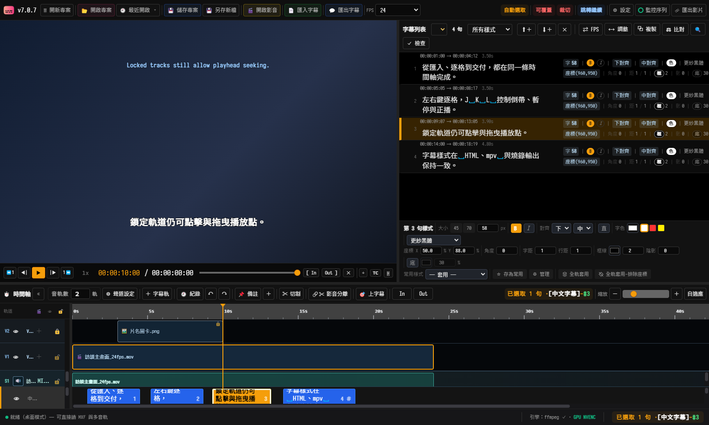
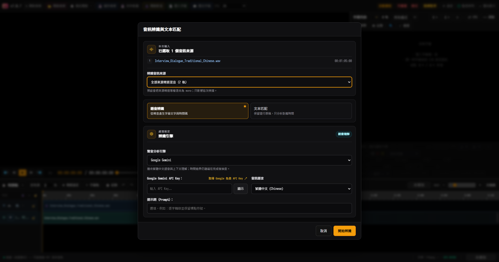
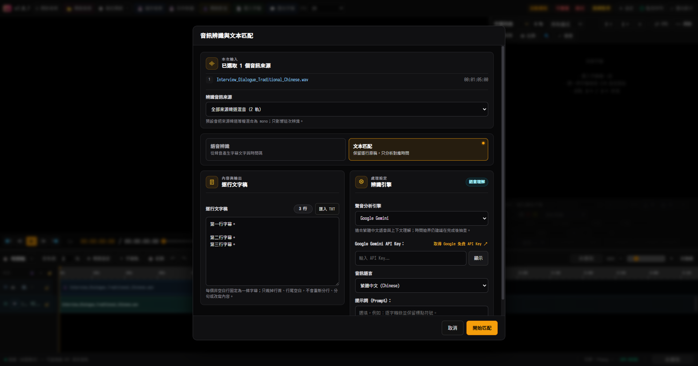
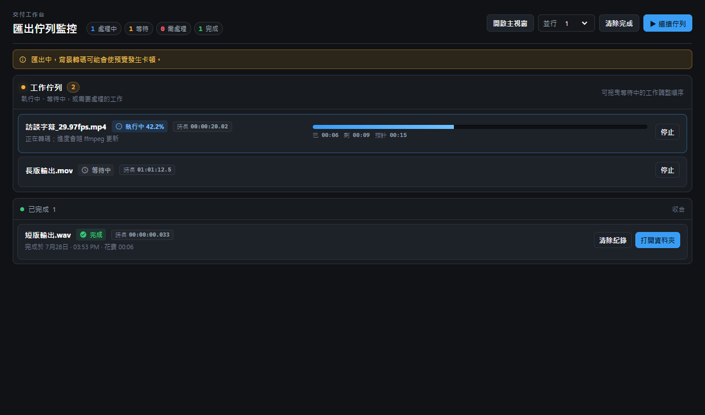

# SUB Tool 使用說明

這份文件只談實際操作。開發、打包與技術細節請看 [文件索引](../README.md#文件)。

## 1. 安裝與開啟

### Windows 桌面版（推薦）

1. 從 [GitHub Releases](https://github.com/evanwayc-star/SUB_Tool/releases/latest) 下載 Setup。
2. 完成安裝後開啟 SUB Tool。
3. 按「開啟影音」，或把影音檔拖進視窗。

桌面版內含 ffmpeg、ffprobe 與 mpv，適合 MXF、MOV、多聲道與大型素材。

### 從原始碼啟動

- `啟動桌面版.bat`：建置後開啟 Electron 桌面版。
- `啟動網頁版.bat`：建置後開啟網頁版。
- `啟動網頁開發版.bat`：啟動可熱更新的開發版。

網頁版適合 MP4、MOV、MP3、WAV 等瀏覽器原生格式；MXF、多音軌與大檔請使用桌面版。

## 2. 介面

| 區域 | 用途 |
|---|---|
| 上方工具列 | 專案、影音、字幕、FPS、設定與匯出 |
| 左上播放器 | 預覽、逐格、JKL、In／Out、安全框與全螢幕 |
| 右側字幕列表 | 文字、時間、樣式、搜尋、比較與檢查 |
| 下方時間軸 | 視訊、圖片、音訊、字幕與播放點 |

拖曳播放器／字幕列表之間的分隔線可調整寬度；拖曳時間軸上緣可調整高度。版面會自動保存。

## 3. 五分鐘完成第一條字幕

1. 匯入影音。
2. 按「＋字幕軌」建立字幕軌；空白專案已自帶一條。
3. 播放到句子開始處，按 `I`。
4. 播放到句子結束處，按 `O`。
5. 在右側字幕列雙擊文字並輸入內容。
6. 用 `←`／`→` 逐格檢查。
7. 按 `Ctrl+S` 儲存 `.subtool` 專案。
8. 按「匯出字幕」或「匯出影片」。

## 4. 播放與定位

### 逐格與 JKL

- `←`／`→`：前後一格；按住可連續逐格。
- `Shift+←`／`Shift+→`：前後一秒。
- `Ctrl+Shift+←`／`Ctrl+Shift+→`：前後五秒。
- `J`：倒帶；連按逐級加速。
- `K`：暫停。
- `L`：正播；連按逐級加速。
- J／L 最高 5×。倒帶期間靜音；單次逐格會保留短促 scrub 音訊。

左右鍵以「目前已呈現畫格」為基準。快速連按時只保留最新目標，避免舊 seek 讓播放點偶爾停在原格；長按方向鍵連續逐格時會自動節流音訊堆疊，專注於畫面的極速連貫跳轉。

### 用滑鼠移動播放點

以下區域都可點擊或按住拖曳：

- 時間尺與時間軸空白處
- 影片、圖片、音訊與字幕區塊
- 波形
- 播放器下方進度條

「跳轉繼續／跳轉暫停」決定播放中用滑鼠跳轉後是否維持播放。原本暫停時只會移動播放點。

### 鎖定軌的定位規則

鎖定是保護內容，不是封鎖播放點：

- 點擊鎖定軌內的區塊，不會選取該區塊。
- 不會清除你原本已選取的影片、音訊或字幕。
- 左鍵仍可改變播放點。
- 左鍵按住拖曳仍可連續移動播放點。

### 其他播放器操作

- 雙擊影片畫面：切換播放器全螢幕。
- 再次雙擊或按 `Esc`：返回原本版面。
- 雙擊目前時碼：直接輸入 `HH:MM:SS:FF`。
- 右鍵目前時碼：複製時碼。
- 右鍵速度數字：選擇 0.1×–4× 播放速度。
- `TC`：顯示監看時碼；不會自動燒入匯出檔。
- `[ In ]`／`[ Out ]`：設定本次預覽或交付範圍；同時按 `[` 與 `]` 清除。

29.97 DF 使用分號，例如 `01:05:28;16`；NDF 使用冒號。

## 5. 時間軸與軌道

### 視訊與圖片

- 拖曳區塊：移動。
- 拖曳左右邊緣：修剪。
- 上下拖曳：移到其他視訊軌。
- `Ctrl+K`：在播放點切割。
- 右鍵：切割、交換順序、修改長度、大小位置、淡入淡出、解除影音或移除。
- 圖片可在播放器直接拖曳與縮放；預設長度為 10 秒。

同軌片段不可重疊；不同視訊軌可疊層。上層透明或淡入淡出時會露出下層。

### 字幕

- 單擊：選取一條。
- `Ctrl`＋單擊：加減多選。
- `Shift`＋單擊：範圍選取。
- 雙擊字幕列表文字：編輯內容。
- 雙擊時間軸字幕：開啟單句編輯與樣式覆蓋。
- `Alt`＋拖曳：複製字幕。
- `Delete`：刪除選取字幕。

播放器中的字幕可直接拖曳。移到字幕上會出現虛線框與上方旋轉點；拖曳旋轉點可旋轉，按住 `Shift` 以 15° 吸附。

### 軌道鎖定

| 軌道 | 鎖定後禁止 |
|---|---|
| 視訊軌 | 選取、移動、修剪、切割、刪除、移入片段 |
| 音訊軌 | 選取與所有素材編輯 |
| 字幕軌 | 選取、文字修改、In／Out、樣式、移動、刪除與新增字幕 |

鎖定字幕軌後，`I`、`O`、`Delete`、內容編輯與樣式控制都不會改到該軌。程式會顯示鎖定提示。

## 6. 字幕樣式

樣式面板只修改目前選取的字幕；沒有選取字幕時，控制項會停用。

- 字級、粗體、斜體、字色
- 上／中／下與左／中／右對齊
- X／Y 座標、角度
- 字距、行距、框線、陰影
- 底色與不透明度
- 直書
- 自備字型與常用樣式

座標以固定 1920×1080 字幕畫布表示。預覽會依實際畫面高度等比縮放，因此換解析度不會改變相對位置。

常用操作：

- 「存為常用」：跨專案保存。
- 「全軌套用」：連同座標與角度套用整軌。
- 「全軌套用－排除座標」：只套外觀。
- 數值欄位滾輪：依欄位步進；按 `Shift` 為十倍步進。

### 自備字型

把字型放入 `font/<顯示名稱>/`。每個資料夾建議只放一個 Regular、非斜體字型檔。

支援 `.ttf`、`.otf`、`.ttc`、`.woff2`。資料夾名是介面顯示名稱；燒錄時會改用字型檔內部家族名。

## 7. 音訊

三個概念請分開：

1. 來源聲道：母素材內的實際聲道。
2. 專案音軌：時間軸上的 A1、A2…，可接收一或多個來源聲道。
3. 輸出 stream：交付檔內的 Mono、Stereo、LtRt 或 5.1。

時間軸音軌列頭可調整：

- M：靜音
- S：獨奏
- 音量
- 鎖定

「聲道設定」負責來源聲道到專案音軌的配線；交付視窗的「音軌」負責專案音軌到輸出 stream 的編組。

## 8. 語音辨識與文本匹配

在影音或音訊素材上按右鍵，選「語音辨識／文本匹配」。

### 語音辨識

由聲音產生文字與時間碼。可選：

- 程式內建本機 AI（基於 Transformers / ONNX WebGPU，完全離線處理）
- Groq（極速 Whisper Large v3 雲端推論）
- OpenAI（官方 Whisper-1 模型，提供逐字與逐句時間戳）
- Azure Speech（支援 Phrase List 與專案專門詞庫）
- Google Gemini（優先採用新一代 2.5 Flash / 2.0 Flash 旗艦模型，語意理解與標點符號最自然，並平滑相容 1.5 系列）
- ElevenLabs（Scribe v2 多語言旗艦語音辨識）

API Key 只填在對應供應商欄位（若使用本機無密碼之 OpenAI 相容 Whisper 伺服器可直接連線）。辨識前可選全部來源聲道混音，或指定單一來源聲道。

### 文本匹配

貼上已校對、已逐行分句的原稿。程式保留每行文字與順序，只分析時間：

- 每個非空白行固定對應一條字幕。
- 可靠行寫入時間碼。
- 無法安全匹配的行保留文字並標成無時間碼，等待人工補 In／Out。
- 空白行不建立字幕。

工作可在背景執行；頂部「辨識中」可重新開啟進度。

## 9. 檢查、比較與搜尋

- 「檢查」或 `Num 9`：檢查重疊、空白、過長、連續相同與非繁中字元。
- `Ctrl+F`：搜尋字幕。
- 「比對」：比較兩份字幕並跳到差異。
- 淺粉色是提示；紅色通常是明確問題；黃色是需要人工判斷的繁簡共用字。
- `Trim` 可一次移除該軌所有字幕的頭尾空白。

## 10. 儲存與匯出

### 專案

- `Ctrl+S`：儲存。
- `Ctrl+Shift+S`：另存新檔。
- `.subtool` 保存字幕、軌道、片段、播放點、音訊路由與版面。
- 桌面版可雙擊 `.subtool` 開啟；若母素材遺失，程式會要求重新連結。

### 字幕檔

- 匯入：SRT、ASS／SSA、Adobe Encore、純文字。
- 匯出：SRT、ASS、Adobe Encore、純文字。
- 匯出文字編碼為 UTF-16 LE 含 BOM。

### 影片與音訊交付

「匯出影片」可建立多列交付：

- MP4 H.264
- MOV ProRes
- WAV
- 原尺寸或指定交付解析度
- 可選燒入時間碼
- 每列獨立設定音訊 stream

送出後由背景佇列處理。工作使用送出當下的凍結快照，之後繼續編輯不會改變已送出的工作。

## 11. 常用快捷鍵

所有快捷鍵都可在「設定」中修改、匯入或匯出。

| 功能 | 預設 |
|---|---|
| 播放／暫停 | `Space` 或 `Enter` |
| 倒帶／暫停／正播 | `J`／`K`／`L` |
| 前後 1 格 | `←`／`→` |
| 前後 1 秒 | `Shift+←`／`Shift+→` |
| 前後 5 秒 | `Ctrl+Shift+←`／`Ctrl+Shift+→` |
| 設定字幕 In／Out | `I`／`O`（也可用 `Q`／`W`） |
| 上／下一個媒體邊界 | `↑`／`↓` |
| 第一格／最後一格 | `Home`／`End` |
| 切割媒體片段 | `Ctrl+K` |
| Undo／Redo | `Ctrl+Z`／`Ctrl+Shift+Z` |
| 儲存／另存 | `Ctrl+S`／`Ctrl+Shift+S` |
| 搜尋 | `Ctrl+F` |
| 安全框 | `Ctrl+G` |
| 截圖／含 TC 截圖 | `T`／`Ctrl+T` |
| 匯出交付清單 | `/` |
| 主視窗／佇列監控切換 | `.` |
| 縮小／放大／自適應時間軸 | `1`／`2`／`\` |

## 12. 檔案與快取

| 位置 | 用途 |
|---|---|
| `你的專案.subtool` | 專案檔 |
| `font/<顯示名>/` | 自備字型 |
| `.subtool_AutoSave/` | 已儲存專案的自動備份 |
| `.subtool_Cache/` | Proxy、波形與逐聲道快取；可刪除後重建 |

如果 MXF 或 MOV 第一次開啟較慢，通常是在建立 Proxy、波形與聲道快取；同一素材第二次會直接使用快取。

- **預覽 Proxy 規格**：系統自動建立 720p **全 I 幀（All-Intra / GOP = 1、無 B 幀、閉合 GOP）** 預覽檔，每一影格獨立自足，確保倒播、快轉、時間軸快速拖曳（Scrubbing）與逐格反應時間為 0 毫秒，徹底消滅預解碼抖動與影格抽搐。
- **匯出交付規格**：匯出影片（MP4 / MOV）嚴格遵循業界標準目標碼率（VBR/CBR）與標準長 GOP 壓縮架構，兼顧高品質呈現與合理檔案容量，絕不受預覽 Proxy 參數影響。
