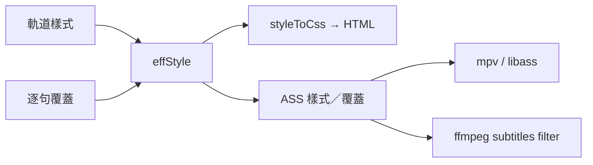
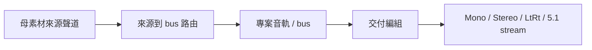
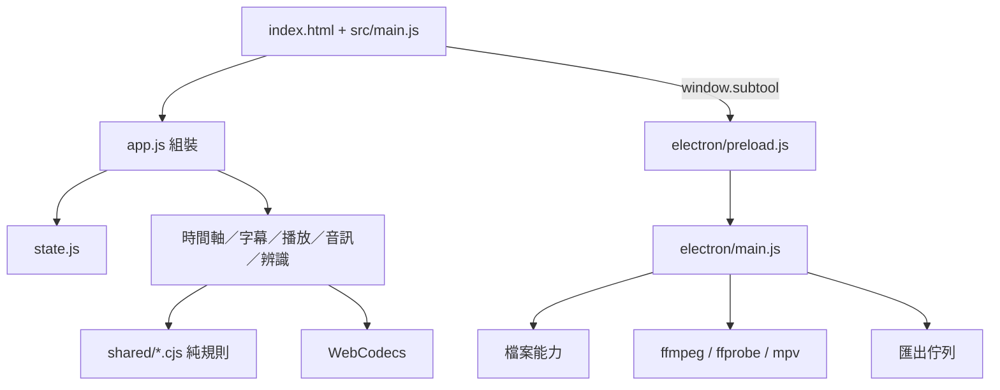
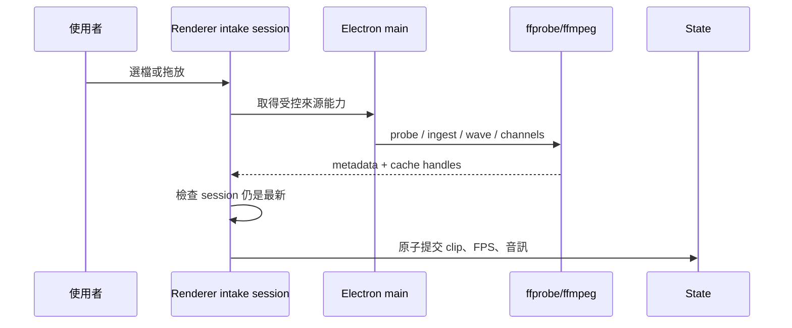
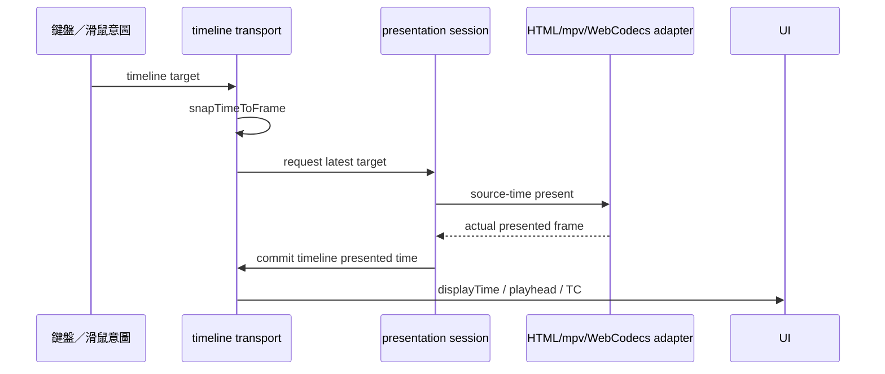

# SUB Tool 技術架構說明

本文件記錄會「畫面看似正常，實際資料卻錯」的核心不變量、模組邊界與資料流。操作看 [使用說明](使用說明.md)；桌面原生整合看 [Electron 維護手冊](Electron_維護手冊.md)。

## 0. 鐵律（Invariants）

### 0.1 三路一致：預覽 ＝ mpv ＝ 匯出燒錄

字幕視覺只有一個規格來源：`substyle.js` 的 `effStyle()`。



任何新樣式欄位都要同時驗證：

1. HTML 預覽
2. mpv／libass 預覽
3. ffmpeg 燒錄輸出

禁止在三條路各自補一份預設值或手算公式。即使 CSS 與 ASS 是不同表達，輸入仍必須是同一份生效樣式。

### 0.2 字幕縮放基準是畫面高 ÷ PlayResY

字幕畫布固定為 1920×1080。字級、框線、陰影、字距、行距與座標的實際縮放，以輸出畫面高度相對 `PlayResY` 的比例計算：

```text
scale = outputHeight / 1080
```

不能用寬度。16:9 時兩者剛好相近，換比例或裁切後才會安靜地露出錯誤。

### 0.3 ASS Fontname 是字型檔內部家族名

`font/<資料夾名>/` 的資料夾名只供 UI 顯示。匯出 ASS 與 libass 必須使用解析字型檔得到的內部 family；找不到時 libass 會靜默 fallback。

### 0.4 Windows filtergraph 路徑要跳脫兩層

ffmpeg filtergraph 內的磁碟冒號與反斜線需要字串層與 filter 層兩次跳脫，例如 `C\\:/...`。用 shell 手動重試會再多一層 shell 解析，診斷時應直接以 `spawn` argv 重現。

### 0.5 時間域：外部是時間軸時間，播放器是來源時間

字幕、播放點、片段邊界、In／Out、備註與 UI 一律使用時間軸時間。HTML video、mpv、WebCodecs 與來源音訊只在播放器邊界使用來源時間。

```text
sourceTime   = clip.in + (timelineTime - clip.offset)
timelineTime = clip.offset + (sourceTime - clip.in)
```

轉換只由序列／媒體邊界負責。播放器事件不可直接寫回 UI；先轉回時間軸時間，再提交呈現位置。

### 0.6 有產出不等於正確

驗證必須看內容：

- 有影片檔，不代表 codec、FPS、聲道、時長或字幕正確。
- IPC 成功，不代表畫面已呈現目標格。
- 截圖有檔，不代表拍到 mpv。
- build 綠，不代表來源 `index.html` 沒被 asar 產物覆寫。
- 兩份手抄公式輸出一致，只證明副本相同，不證明規格正確。

需要以 ffprobe、像素／畫格觀察、實際輸入與內容矩陣驗證。

### 0.7 顯示狀態看 computed style

CSS 作者規則可能蓋過瀏覽器的 `[hidden]`。要判斷使用者實際看到什麼，讀 `getComputedStyle()`；要隱藏已有 `display` 規則的元件，補專用 `[hidden]` CSS。

### 0.8 音訊素材、專案 bus、輸出 stream 是三層



- 來源聲道：素材內的 stream／channel。
- 專案音軌：可混合多個來源的單聲道 bus。
- 輸出 stream：容器內的交付音訊串流。

播放快取、波形與 Proxy 不能成為交付來源。匯出 plan 的檔案必須是母素材，主程序也會拒絕快取路徑。

### 0.9 靜態圖片也是時間軸片段

圖片有自己的 offset、in、out、軌道、幾何與淡入淡出，必須在整段期間持續合成，不是播放器的一格畫面。

Windows mpv 是 OS 子視窗；透明 guide 視窗必須保持`永久穿透`，不能接管滑鼠。圖片與字幕操作都由主視窗的 `#imageLayer`／字幕互動層處理，並維持`單一互動入口`。不要再建立 guide pointer IPC。

## 1. 執行架構

SUB Tool 使用 Vite 與原生 ES modules，沒有前端框架。Vite 將 renderer 打成單一 `dist/index.html`；同一份介面可在瀏覽器與 Electron 執行。



### Renderer

- `src/main.js`：import `app.js`，啟動 renderer。
- `src/app.js`：唯一頂層組裝、DOM 綁定與事件訂閱。
- `src/state.js`：可序列化的專案狀態與設定。
- `src/events.js`：少數跨模組 UI invalidation 的同步事件匯流排。

低階模組不可 import `app.js`。跨模組規則優先直接 import 明確介面；只有為了切斷循環或跨越組裝邊界時才 emit。

### Electron

- `electron/preload.js`：以 contextBridge 暴露受限的 `window.subtool`。
- `electron/main.js`：視窗、IPC 與各 native adapter 的組裝層。
- `electron/file-authority.js`：檔案 capability 與讀寫權威。
- `electron/media-intake-runtime.js`：probe、Proxy、波形、聲道快取與 lease。
- `electron/mpv-host.js`：Windows mpv 子視窗與精準呈現。
- `electron/export-queue.js`／`delivery-runner.js`：背景交付。

## 2. 模組所有權

| 領域 | 主要 owner | 邊界 |
|---|---|---|
| 選取狀態 | `state.js`、`timeline-selection.js` | 其他模組只能走 selection API |
| 時碼與格網 | `time.js` | 秒、DF／NDF、frame snap |
| 呈現生命週期 | `media-presentation-core.js` | 同時一個 in-flight，只保留最新 pending |
| 播放協調 | `media.js`、`transport-controller.js` | 時間軸意圖、實際畫格與音訊同步 |
| 播放器差異 | `media-player-adapter.js` | HTML video／mpv 的共同介面 |
| 序列映射 | `sequence.js`、`timeline-transport.js` | 時間軸時間 ↔ 來源時間 |
| 媒體准入 | `media-intake-session.js`、`loaders/media-loader.js` | 單次載入 identity、取消與提交 |
| 專案載入 | `project-load-session.js`、`project.js` | 最新專案才能提交 |
| 時間軸手勢 | `timeline-gesture-transaction.js` | preview／commit／cancel，一次一筆 history |
| 時間軸渲染 | `timeline-renderer.js`、`painters/*` | 幾何、gutter、片段、波形與字幕 |
| 字幕模型 | `subtitle-model.js`、`subtitles.js` | 內容、時間、選取與鎖定 |
| 字幕樣式 | `substyle.js`、`subtitle-style-engine.js` | 生效樣式與三路表達 |
| 音訊路由 | `audio-routing-model.js`、`project-audio.js` | source → bus → export layout |
| 語音辨識 | `speech-recognition-session.js` | 單一工作、取消、exactly-once commit |
| 文本匹配 | `transcript-alignment.js`、`recognition-alignment-result.js` | 原稿行與時間證據 |
| 交付提交 | `export-submission-transaction.js` | 凍結專案與多列 delivery |
| 交付計畫 | `export-job-builder.js`、`delivery-audio.js` | renderer 產生可執行規格 |
| WebCodecs | `decode/player.js`、`decode/demux.js` | 多層預覽與串流索引 |

名稱中帶 `*-engine` 的模組通常是可注入、可獨立測的深層規則；adapter／view 負責接 DOM、State 或 Electron。

## 3. 核心資料

### State

`State` 保存可序列化的專案資料：

- `tracks`／`cues`：字幕軌與字幕
- `videoTracks`／`clips`：視訊軌、影片與圖片片段
- `audioProject`：bus、來源路由與輸出編組
- `externalAudioSources`：獨立音訊素材
- `notes`：備註
- `fps`／`dropFrame`／`duration`：時間基準
- `viewStart`／`pxPerSec`：時間軸視窗

不可直接從其他模組寫 `selectedId`、`selectedIds`、`selectedClipId`、`selectedAudioClipId`、`activeTrackKind`；eslint 會要求走 selection API。

### Cue

```js
{
  id,
  start,
  end,
  text,
  track,
  timed: true,
  style: {}
}
```

`timed:false` 代表保留原稿但尚無可信時間碼。它不可被偷偷補成假時間。

### Clip

影片與圖片共用時間軸 placement：`offset`、`in`、`out`、`vtrack`。圖片另有幾何；影片可有來源 FPS、音訊 source id 與 Proxy 狀態。

### Project snapshot

`.subtool` 只保存可重建、可遷移的專案資料，不保存 Web Audio node、DOM、Blob URL、ffmpeg process 或 mpv handle。

## 4. 關鍵資料流

### 媒體載入



較舊的專案或素材載入完成時不得覆蓋較新的選擇；session identity 是提交前的最後閘門。

### Seek 與逐格



UI 可立即顯示目標，但權威「呈現位置」只在播放器證明實際畫格後提交。較舊回應不可覆蓋較新的 pending 目標。

### 時間軸手勢

```text
pointerdown → capture target/selection → movement threshold
            → preview repeatedly → pointerup commit once
            → Escape/cancel restores original
```

未超過門檻的 click 只做選取或 seek。鎖定素材不進編輯 target，但 pointer seek 仍可使用整條軌道。

### 字幕樣式

軌道樣式、常用樣式參照與逐句覆蓋合成後才是生效樣式。拖曳字幕位置或旋轉只建立逐句覆蓋；「全軌套用」才改整軌。

### 匯出


工作送出後與 live project 脫鉤。renderer 準備 ASS 與交付規格；main process 負責權限、argv、process、lease、watchdog、成品 probe 與終態。

## 5. events.js（同步事件匯流排）

事件匯流排是同步、進程內、沒有 replay 的 UI invalidation 通道。主要類型：

- `render:*`：字幕列表、樣式或預覽需要重繪
- `timeline:invalidate`：時間軸資料或 metadata 變動
- `media:*`：播放點、媒體與 presenter 狀態
- `action`：組裝層接收 UI 命令

規則：

- 新增 emit 前先確認存在訂閱者。
- 不要為同一件事建立多個別名。
- 有明確方向的跨模組呼叫優先直接 import。
- State mutation 與 render event 要在同一交易邊界完成。

## 6. 桌面版與網頁版

以 `window.subtool` 是否存在判斷桌面能力。

| 能力 | 網頁版 | Electron |
|---|---|---|
| 原生格式播放 | HTML video | HTML／mpv／WebCodecs |
| MXF／非原生格式 | 受限 | ffmpeg ingest + mpv／Proxy |
| 大檔 | 瀏覽器限制 | 檔案路徑與串流讀取 |
| 多聲道 | 瀏覽器能力受限 | ffprobe + 逐聲道快取 |
| 存取檔案 | File API／下載 | main process capability |
| 匯出 | 瀏覽器下載 | 背景 ffmpeg 佇列 |

Renderer 不得因拿到路徑字串就假設有讀寫權。桌面檔案必須經 preload API 與 main 的 capability 判斷。

## 7. WebCodecs 與 demux

WebCodecs 用於瀏覽器原生影片的多層合成與即時疊層：

- `decode/demux.js`：從 MP4 container 讀 sample。
- `decode/sample-index.js`：time／sample 算術與 keyframe 索引。
- `decode/decoder.js`：管理 VideoDecoder 與 frame lease。
- `decode/player.js`：依時間軸計畫組合可見影片、圖片與淡入淡出。

長片採串流索引，不把整支素材載入記憶體。每層完成 `drawImage()` 後回報實際來源 timestamp；所有可見層都完成才可提交呈現位置。

## 8. 字幕渲染細節

- 文字不自動折行；只保留使用者明確換行。
- `substyle.js` 定義 `STYLE_DEFAULTS` 與樣式正規化。
- HTML 以 CSS 呈現；mpv／ffmpeg 以 ASS 呈現。
- 字幕背景先依整段文字框計算，再向外擴張。
- 左／中／右 × 上／中／下都要做對齊矩陣測試。
- 直書、框線、陰影、背景、旋轉、字距與行距都要跑三路契約。

## 9. shared/

`shared/*.cjs` 只放 renderer 與 main 都需要的零相依純規則，目前包含：

- 來源聲道展開
- 片段淡入淡出
- 交付解析度
- 圖片／片段幾何

檔名淨化與路徑圍堵是兩層不同安全防線，不可合併。CSS 與 ASS 是同一規格的不同表達，也不放進 shared。

詳見 [shared/README](../shared/README.md)。

## 10. 驗證策略

| 層級 | 驗證 |
|---|---|
| 純規則 | Vitest 數值、狀態機與 property matrix |
| 模組契約 | renderer／main 共享規則、CSS／ASS 三路輸出 |
| Repository | 連結、入口、目錄、命名、package 與來源 HTML |
| Renderer 真機 | Electron + CDP + 真實滑鼠／鍵盤 |
| Native | mpv time-pos／playback-restart、ffmpeg、ffprobe |
| 發版 | 正常安裝、捷徑、App 內版本、遠端 asset hash |

最低守門：

```bash
npm run lint
npm test
npm run build
rg "from './app.js'" src
```

播放、mpv、MXF、MOV、逐格與匯出仍需依 [開發與驗證](開發與驗證.md) 做真機驗收。
