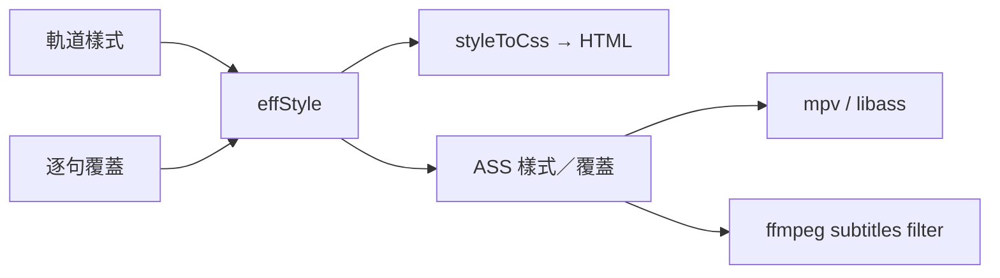
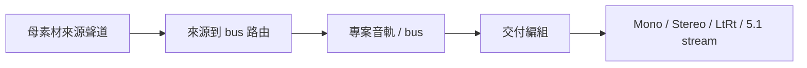
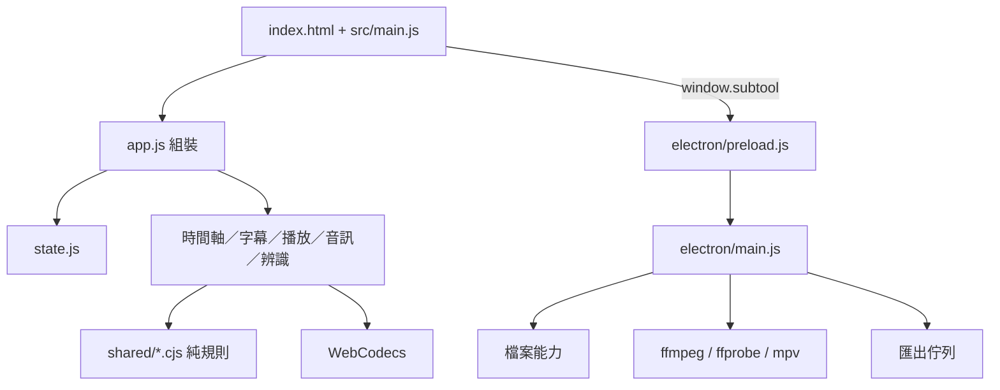
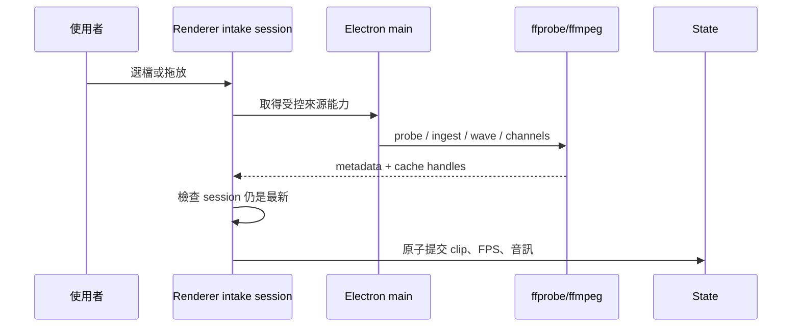
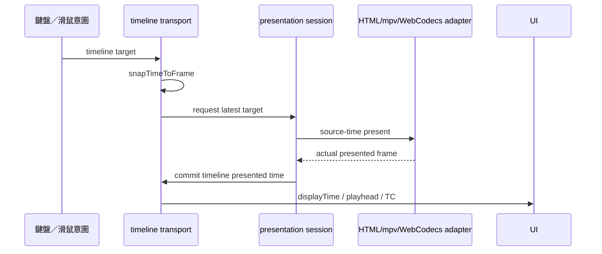

# SUB Tool 技術架構說明

本文件記錄會「畫面看似正常，實際資料卻錯」的核心不變量、模組邊界與資料流。操作看 [使用說明](使用說明.md)；桌面原生整合看 [Electron 維護手冊](Electron_維護手冊.md)。

## 0. 鐵律（Invariants）

### 0.1 三路一致：預覽 ＝ mpv ＝ 匯出燒錄

字幕視覺只有一個規格來源：`substyle.js` 的 `effStyle()`。


```mermaid
flowchart LR
  T[軌道樣式] --> E[effStyle]
  C[逐句覆蓋] --> E
  E --> H[styleToCss → HTML]
  E --> A[ASS 樣式／覆蓋]
  A --> M[mpv / libass]
  A --> F[ffmpeg subtitles filter]
```

任何新樣式欄位都要同時驗證：

1. HTML 預覽
2. mpv／libass 預覽
3. ffmpeg 燒錄輸出

禁止在三條路各自補一份預設值或手算公式。即使 CSS 與 ASS 是不同表達，輸入仍必須是同一份生效樣式。

### 0.2 字幕縮放基準是畫面高 ÷ PlayResY

字幕畫布固定為 1920×1080。字級、框線、陰影、字距、行距與座標的實際縮放，以輸出畫面高度相對 `PlayResY` 的比例計算：

```text
scale = outputHeight / 1080
```

不能用寬度。16:9 時兩者剛好相近，換比例或裁切後才會安靜地露出錯誤。

### 0.3 ASS Fontname 是字型檔內部家族名

`font/<資料夾名>/` 的資料夾名只供 UI 顯示。匯出 ASS 與 libass 必須使用解析字型檔得到的內部 family；找不到時 libass 會靜默 fallback。

### 0.4 Windows filtergraph 路徑要跳脫兩層

ffmpeg filtergraph 內的磁碟冒號與反斜線需要字串層與 filter 層兩次跳脫，例如 `C\\:/...`。用 shell 手動重試會再多一層 shell 解析，診斷時應直接以 `spawn` argv 重現。

### 0.5 時間域：外部是時間軸時間，播放器是來源時間

字幕、播放點、片段邊界、In／Out、備註與 UI 一律使用時間軸時間。HTML video、mpv、WebCodecs 與來源音訊只在播放器邊界使用來源時間。

```text
sourceTime   = clip.in + (timelineTime - clip.offset)
timelineTime = clip.offset + (sourceTime - clip.in)
```

轉換只由序列／媒體邊界負責。播放器事件不可直接寫回 UI；先轉回時間軸時間，再提交呈現位置。

### 0.6 有產出不等於正確

驗證必須看內容：

- 有影片檔，不代表 codec、FPS、聲道、時長或字幕正確。
- IPC 成功，不代表畫面已呈現目標格。
- 截圖有檔，不代表拍到 mpv。
- build 綠，不代表來源 `index.html` 沒被 asar 產物覆寫。
- 兩份手抄公式輸出一致，只證明副本相同，不證明規格正確。

需要以 ffprobe、像素／畫格觀察、實際輸入與內容矩陣驗證。

### 0.7 顯示狀態看 computed style

CSS 作者規則可能蓋過瀏覽器的 `[hidden]`。要判斷使用者實際看到什麼，讀 `getComputedStyle()`；要隱藏已有 `display` 規則的元件，補專用 `[hidden]` CSS。

### 0.8 音訊素材、專案 bus、輸出 stream 是三層


```mermaid
flowchart LR
  S[母素材來源聲道] --> R[來源到 bus 路由]
  R --> B[專案音軌 / bus]
  B --> L[交付編組]
  L --> O[Mono / Stereo / LtRt / 5.1 stream]
```

- 來源聲道：素材內的 stream／channel。
- 專案音軌：可混合多個來源的單聲道 bus。
- 輸出 stream：容器內的交付音訊串流。

播放快取、波形與 Proxy 不能成為交付來源。匯出 plan 的檔案必須是母素材，主程序也會拒絕快取路徑。

### 0.9 靜態圖片也是時間軸片段

圖片有自己的 offset、in、out、軌道、幾何與淡入淡出，必須在整段期間持續合成，不是播放器的一格畫面。

Windows mpv 是 OS 子視窗；透明 guide 視窗必須保持`永久穿透`，不能接管滑鼠。圖片與字幕操作都由主視窗的 `#imageLayer`／字幕互動層處理，並維持`單一互動入口`。不要再建立 guide pointer IPC。

## 1. 執行架構

SUB Tool 使用 Vite 與原生 ES modules，沒有前端框架。Vite 將 renderer 打成單一 `dist/index.html`；同一份介面可在瀏覽器與 Electron 執行。


```mermaid
flowchart TB
  UI[index.html + src/main.js] --> APP[app.js 組裝]
  APP --> STATE[state.js]
  APP --> DOMAIN[時間軸／字幕／播放／音訊／辨識]
  DOMAIN --> SHARED[shared/*.cjs 純規則]
  UI -->|window.subtool| PRELOAD[electron/preload.js]
  PRELOAD --> MAIN[electron/main.js]
  MAIN --> FILES[檔案能力]
  MAIN --> NATIVE[ffmpeg / ffprobe / mpv]
  MAIN --> QUEUE[匯出佇列]
  DOMAIN --> WC[WebCodecs]
```

### Renderer

- `src/main.js`：import `app.js`，啟動 renderer。
- `src/app.js`：唯一頂層組裝、DOM 綁定與事件訂閱。
- `src/state.js`：可序列化的專案狀態與設定。
- `src/events.js`：少數跨模組 UI invalidation 的同步事件匯流排。

低階模組不可 import `app.js`。跨模組規則優先直接 import 明確介面；只有為了切斷循環或跨越組裝邊界時才 emit。

### Electron

- `electron/preload.js`：以 contextBridge 暴露受限的 `window.subtool`。
- `electron/main.js`：視窗、IPC 與各 native adapter 的組裝層。
- `electron/file-authority.js`：檔案 capability 與讀寫權威。
- `electron/media-intake-runtime.js`：probe、Proxy、波形、聲道快取與 lease。預覽 Proxy 使用 720p、無 B 幀及閉合的短 GOP；通常為 GOP 1，NVIDIA NVENC 因編碼器限制使用 GOP 2。它減少 seek、倒帶與逐格的解碼依賴；實際呈現仍以播放器回報的畫格為準。
- `electron/mpv-host.js`：Windows mpv 子視窗與精準呈現。
- `electron/export-queue.js`／`delivery-runner.js`：背景交付。各交付格式由 `export-plan.js` 決定碼率、GOP 與封裝，並遵守鐵律 §0.8（匯出只讀母素材，不讀 Proxy 快取）。

## 2. 模組所有權

| 領域 | 主要 owner | 邊界 |
|---|---|---|
| 選取狀態 | `state.js` | 其他模組只能走 selection API |
| 時碼與格網 | `time.js` | 秒、DF／NDF、frame snap |
| 呈現生命週期 | `media-presentation-core.js` | 同時一個 in-flight，只保留最新 pending |
| 播放協調 | `media.js`、`transport-controller.js` | 時間軸意圖、實際畫格與音訊同步 |
| 播放器差異 | `media-player-adapter.js` | HTML video／mpv 的共同介面 |
| 預覽截圖 | `video-renderer.js` 的 `capturePreviewFrame()` | 擷取實際 presenter、凍結時間與圖片計畫；command 負責 TC 與保存 |
| 圖片合成 | `image-compositor-engine.js` | 圖片／影片共同層序、矩形、軌道裁切與淡化；DOM／Canvas adapter 共用計畫 |
| 序列映射 | `sequence.js`、`transport-controller.js` | 時間軸時間 ↔ 來源時間 |
| 媒體准入 | `media-intake-engine.js`、`media-loader.js` | 單次載入 identity、取消與提交 |
| 專案讀寫 | `project-intake-engine.js`、`project.js` | 最新專案才能還原；儲存依序寫入並使用實際寫入快照判斷 dirty |
| 對話框生命週期 | `ui.js` | session 核對視窗歸屬；過期工作不得關閉或覆寫新視窗 |
| 時間軸手勢 | `timeline-gesture-transaction.js` | preview／commit／cancel，一次一筆 history |
| 時間軸渲染 | `timeline-renderer.js`、`painters/*` | 幾何、gutter、片段、波形與字幕 |
| 字幕模型 | `subtitle-model.js`、`subtitles.js` | 內容、時間、選取與鎖定 |
| 字幕樣式 | `substyle.js`、`subtitle-style-engine.js` | 生效樣式與三路表達 |
| 常用樣式管理 | `preset-library.js` | 管理視窗、合法匯入、草稿目標與提交歸屬 |
| 字幕比對視窗 | `electron/compare-window.js`、`electron/compare.html` | 視窗載入期間保留最新快照；操作保留建立時的 revision |
| 片段與外部音訊資料 | `sequence.js`、`external-audio.js` | 完整 metadata、切分、合法來源範圍與持久化 |
| 音訊效果 | `audio-effects.js`、`shared/audio-loudness.cjs` | 來源效果、工作取消與有效結果提交；Media 接播放器，dialog 只接 UI |
| 音訊配線編輯 | `audio-routing-engine.js`、`audio-routing.js` | 完整草稿、即時預覽、巢狀設定、取消與一次提交 |
| 音訊路由計畫 | `project-audio.js`、`export-job-engine.js` | source → bus → export layout；交付編組保留母素材 inputs |
| 語音辨識 | `speech-recognition-engine.js`、`speech-recognition-session.js` | 多供應商/本機推論引擎、單一工作、取消、exactly-once commit |
| 人聲波形 | `vocal-waveform-source.js`、`vocal-waveform-worker-client.js`、`vocal-waveform-worker.js` | 母素材分段讀取、人聲分離與語音區段、可取消的來源波形 |
| 文本匹配 | `transcript-alignment.js` | 原稿行、時間證據與對齊決策 |
| 交付提交 | `subio.js`、`delivery-job.js`、`delivery-list.js` | 凍結專案快照、逐列規格與交付送出防護 |
| 交付計畫 | `electron/export-plan.js` | 有效片長、音訊、容量與相容的 codec／SAR／mux 一次決定 |
| 成品階段 | `electron/export-artifact.js` | 準備編碼目的地、封裝與驗證、清理私有素材；lease 與終態由 watchdog 裁定 |
| WebCodecs | `decode/player.js`、`decode/demux.js` | 多層預覽與串流索引 |

名稱中帶 `*-engine` 的模組通常是可注入、可獨立測的深層規則；adapter／view 負責接 DOM、State 或 Electron。

### 專案儲存與對話框

`Project.save()`／`saveAs()` 在呼叫時凍結資料，依序完成寫入。dirty 比對的基準是實際寫入的快照，因此存檔期間繼續編輯仍算未儲存；刪除全部已保存內容也算修改。新專案會撤銷舊存檔更新目前路徑與狀態的資格。開啟／關閉前選擇儲存，必須確認成功後仍無新增修改，才能繼續丟棄目前專案。

`Project.open()` 從確認、選檔與 IPC 讀取之前持有開啟意圖。工具列、最近專案、OS 開檔與專案拖放共用這個入口；較晚的請求、取消或工作區替換會使舊讀取失效。讀取期間新增的已提交內容必須重新確認，播放點移動不算新增修改。接受檔案後才交給既有序列載入工作；路徑授權仍由主程序裁定。最近清單的 DOM 發布另由選單模組核對讀取序號與節點身分。

`openModal()` 回傳 session，非同步操作完成後先以 `isCurrent()` 確認仍屬於同一視窗，或以 session 的 `close()` 收尾。`onDismiss` 處理一般關閉，`onReplaced` 處理被其他視窗取代；音訊配線同一編輯的重繪與父子導航會明確交接 session，其他替換則撤回整段草稿。缺字型提示在關閉、替換或要求載入另一專案時結束等待，不阻塞後續載入。

刪除字幕、複製軌道與新建專案的延遲確認持有原專案、軌道及目標物件；Undo 即使重建同 ID 的物件，舊確認也不能修改它。片段編輯送出前再次核對原片段、軌道和兩層鎖定，並以目前同軌相鄰片段限制長度；其他軌的片段不限制重設 Trim。

字幕匯入同時核對匯入序號與專案歸屬，FPS 提示被關閉或替換時結束等待。選定 FPS 保留在匯入草稿，直到目的軌確認才與字幕一起提交並記錄一次 History；取消不改專案格網，期間合法修改格網也會使舊草稿失效。`pickFile()` 對選取、原生取消與同一 input 的再次使用都恰好結束一次。字幕編輯與辨識視窗的延遲初始化只操作自己的 session；辨識視窗關閉仍保留背景工作，實際替換專案則取消舊專案工作。常用樣式草稿綁定原有軌道、字幕與樣式物件，專案替換或 Undo 會撤銷草稿。

快捷鍵設定視窗自行建立 DOM，也要有相同的結果歸屬：關閉或重開時撤銷舊視窗的 Escape 監聽。每次匯入、錄製、刪除或還原預設都更新草稿 revision；較新匯入即使取消，也會撤銷先前讀取。遲到的檔案內容不得覆蓋同一視窗較新的草稿或新視窗的設定。

專案缺字型檢查會等待共用的字型載入工作完成，再比對實際字寬。`document.fonts.check()` 只表示沒有待載入的相符 face，不可當作字型已安裝的證據。常用樣式與專案內嵌樣式在遷移前先驗證形狀，單筆毀損資料不會中斷整份專案的載入。

常用樣式以內建／自訂、群組與名稱共同識別，同名不同群組可獨立選取、匯入與嵌入專案。`substyle.js` 統一樣式欄位的型別與合法值；一般專案與樣式庫保留合法歷史數值，ASS 中繼資料另明確要求原有範圍限制。套用字幕樣式由 `subtitles.js` 提供實際目標軌道，純樣式計畫不自行猜測軌道。

重新命名或覆寫常用樣式時只提交原本選定的項目，合併至目前樣式庫，保留確認期間新增的其他樣式；目標被替換或名稱已被占用時拒絕舊提交。

`style-panel-controller.js` 的全軌套用確認保存原軌道及字幕物件集合；確認期間新增、移除或替換字幕，即使總數相同也必須重新確認。送出時再次檢查專案歸屬、對話框 session 與軌道鎖定，不能把舊確認套到新範圍。

### 音訊配線編輯

`AudioRoutingModel` 的編輯 session 擁有完整草稿與巢狀輸出設定的還原點。project adapter 將草稿投影到專案供即時預覽，delivery adapter 只改該交付列。UI 轉交操作，儲存、取消與 history 的排序由 session 決定；開啟／重繪子視窗不建立新的根編輯。儲存根編輯時才記一筆 history，取消或一般關閉會還原完整配線，不留下預覽步驟。預設配置保留未選用的來源 bus；明確縮減 bus 才修剪配線。

### 預覽與 History

配線預覽期間，History 的音訊快照投影保留編輯前已提交的配線，讓背景工作照常記錄其他資料。根編輯儲存時先解除投影再記錄，Undo 只撤回配線而保留期間完成的背景工作；取消或失效的編輯也會解除自己持有的投影。

字幕、片段與幾何手勢沿用 History 的已提交快照投影：背景工作可以記錄自己的修改，卻不會將尚未提交的預覽寫進 Undo。確認先解除投影再記錄；取消、視窗替換、途中鎖定或手勢失效只撤回自己仍持有的預覽，不覆蓋其他工作已提交的修改。

軌道高度手勢核對最後一次寫入的高度；字幕位置與旋轉手勢只擁有其修改的樣式欄位。History 的 `projectField` 可將這些欄位投影回提交值，同時保留目前樣式中其他欄位，避免背景顏色等更新被整份樣式快照覆蓋。

列表、時間軸文字與單句編輯使用 `beginCueEdit()` 持有草稿及最後預覽寫入的欄位證據。History 投影、取消和晚到確認只能操作仍由本次編輯持有的欄位；未修改的草稿欄位保留背景提交值，競爭同一欄位時要求重新開啟編輯。字幕時間的合法格網上下限與至少一格由字幕模型集中計算，列表、鍵盤位移與批次時長共用；覆蓋鄰句、選取與記錄仍保留各操作政策。

跨 FPS 貼上以目的專案格網重新計算起訖及至少一格的時長；暫定終點在換選取或退出上字幕模式時也由字幕模型合法化。文字交換保存實際字幕物件及原文字，Undo 重建同 ID 字幕或其他工作改字後，不得沿用舊交換目標。

備註文字、時間與批次文字編輯保留 DOM 草稿，確認前核對專案、實際備註物件、History 世代與原欄位；時間編輯另核對 FPS revision。未改的單句草稿保留背景提交，批次先核對全部目標再一次寫入，取消不回寫舊值。

`History.committedSnapshot()` 同時供 Undo 與 Project 儲存、自動備份及 dirty 判斷使用。Project 先合併尚未重連的持久素材，再投影已提交值，最後序列化；影片與外部音訊的長度也以投影後的時間軸範圍計算。即時預覽仍讀 live State。

樣式面板每次輸入立即記錄，`recordCoalesced()` 只合併同一 owner 仍在 History 最上方的那一筆，owner 同時核對實際選定的字幕物件集合。換選取目標、其他工作、Undo 或新專案介入後會另建紀錄；回到原值則刪除沒有變更的步驟。500ms timer 只結束合併期間，不再延遲讀取整份 State。

### 交付計畫與成品階段

`prepareDeliveryPayload()` 是入列與 `buildDeliveryArgv()` 共用的純規則介面：套用固定規格、正規化音訊、驗證 TC 並計算有效片長。佇列保存 SMPTE `;` 時碼；只有建立 FFmpeg argv 時才轉為 filtergraph 所需的 `.`。`buildDeliveryArgv()` 從完整工作決定航空 codec／mux 或光碟容量預算。runner 不傳入預先算好的格式設定，避免較長音訊尾端與容量估算、DMPES 4M 與 1.5M transport profile 各自配錯。`airline-encoding.js` 與 `disc-encoding.js` 是其內部純規格實作；輸入能力驗證仍由主程序執行。

字幕交付的重疊檢查由 `subtitle-audit.js` 共用完整區間掃描；長句包住數個短句時，每個受影響的字幕都會被標出，不能只比較排序後的上一句。

匯出範圍裁切由 `delivery-job.js` 一次產生影片與外部音訊的淡化原始時鐘；`export-plan.js` 編譯 `fade`／`afade` 時暫時還原該時鐘，再還原輸出 PTS。因此從淡化中途開始的成品維持原來的亮度和音量，中段截取不會重新淡入／淡出。H264-MP4 固定經過編碼計畫，因為快照不含已驗證的來源 codec 與封包結束位置，不能安全使用 stream copy。

音訊延遲後以連續取樣時鐘建立 PTS，再裁切交付範圍。FFmpeg `adelay` 的前置靜音可能沒有 PTS；若直接以首個有效 PTS 重設起點，後面的音訊會提早到時間軸零點。驗證必須比對實際 PCM 的位置與淡化曲線。

片段切分保留原始淡化時鐘，左修剪同步移動原始視窗偏移，交付範圍裁切再疊加偏移。明確修改淡入淡出或建立交叉淡化時，改以目前片段建立新視窗；手勢取消及 History 同時處理偏移。凍結快照保存影片與圖片相同的縮放、位置和原始尺寸，也保存視訊軌可見性；交付計畫略過隱藏畫面，音訊仍依獨立配線規則編譯。

外部音訊切割同樣保存原始淡化視窗與各段來源偏移，重複切割、Undo、存檔與重開都不能重新起算淡化。使用者明確改淡化設定時才建立新的片段視窗。原生主影片疊合監聽的獨立播放器按 L／R 來源座標接回 project bus；其事件與音訊節點由同一素材工作持有，重設或替換後的晚到事件不得播放舊元素。

成品階段的準備與收尾共用生命週期，包含等待準備完成後再處理取消。watchdog 保有輸出 lease、程序存活、取消與終態權威；成品模組透過它提供的寫入與程序登記操作執行各格式收尾，並統一光碟編碼與製作階段的進度換算，避免編碼完成時過早顯示 100%。原生執行及封裝細節見 [Electron 維護手冊](Electron_維護手冊.md#交付)。

### 音訊效果與背景工作

來源保存母素材路徑及 `audioLimiterSpec`（包含各 stream 的量測結果）；專案、Undo／Redo 與交付快照共用 `audio-loudness.cjs` 的正規化規則。播放快取與進度不進入專案。匯出從母素材的完整 stream 套效果，再切聲道、裁切時間與套用 gain／fade，避免裁切後重新量測而改變音量。

`audio-effects.js` 以來源身分管理工作；同來源只接受最後一次操作，不同來源可並行。Media adapter 準備成功才安裝播放器並提交效果，失敗保留既有效果。還原、Undo 或專案切換取消舊工作；每次非同步返回再核對來源物件、母素材路徑與工作世代。主程序用 sender 與 request id 隔離進度和取消，取消會停止 FFmpeg。重開與 Redo 由保存的設定重建預覽，不新增歷史；快取遺失時也能重新處理。

HTML 串流、一般解碼與原生 WAV 的母音軌及波形都交給 Media 的原音安裝入口。已有有效效果時，晚到母音只保存為還原來源，不能取代正在監聽的效果或波形；安裝母音 buffer 時保留各聲道波形。

串流轉檔的完成通知也可能早於影片 metadata。載入工作先接收並持有自己 job 的完成資料，待來源建立後安裝一次；換檔、重設與載入失敗釋放監聽，其他 job 的通知不能安裝到目前來源。

逐格 scrub 使用同一專案音訊解讀與 Web Audio 路由，包含來源／bus gain、mute 與聲道配線。銷毀素材同時銷毀 scrub voice，遲到的 metadata 或播放完成回應不能重新啟動已撤銷的元素。

`project-audio.js` 只在同一來源有可聽的 element／buffer 替代播放時抑制 native 音訊；其他來源的外部配音不會關掉主影片或它的 scrub。mute、solo 與 bus 路由仍由同一專案音訊解讀裁定。

AudioEngine 的 transport 停止與起播會一併取消短促 scrub 聲音，包括主影片 fallback、外部音訊的獨立 clone 與 buffer scrub。取消使等待中的 metadata、play Promise 與 timer 失效；保留素材本身的快取，下一次合法單格操作仍可播放短促聲音。

### 人聲波形的顯示邊界

`Wave` 的來源 registry 保存 MIX／聲道／人聲的顯示選項及完整來源時間的 100 Hz min/max；選項、進度與峰值不進入 State、History 或專案檔。片段修剪與 offset 仍由時間軸既有來源時間映射決定。音訊列頭切換整列來源，個別片段右鍵維持單來源；混用時明示混合狀態。

`vocal-waveform-source.js` 從 `audioMotherPath()` 讀母素材，桌面每次取 30 秒中心與前後各 2 秒 context 的 44.1 kHz 立體聲 PCM，不使用 4 kHz 波形快取。來源串流依 descriptors 混合；音訊先於影片結束時，成功解碼的 EOF 按原位置補零。同母素材的切片共享進行中的分析，各自訂閱進度與取消，最後一位訂閱者離開才中止推論。

Worker 使用固定版本模型與 SHA-256 驗證的 IndexedDB 模型快取；公開 PFFFT STFT／ISTFT 接 UVR MDX 分離，再以 Silero VAD 標記語音區段。重疊窗口涵蓋不足一窗的尾端；桶數以整數 sample 計算，避免 30.07 秒尾段的浮點溢位。語音降採樣偵測左右極性抵銷，避免有效立體聲變成靜音。模型與依賴的研究來源見 [人聲波形模型研究](research/人聲波形模型研究.md)。

正常完成保留 Worker 與來源峰值；取消終止實際 Worker 推論及所有失去訂閱者的 native PCM 工作。registry 身分、來源母路徑與世代擋住晚到結果。分離期間保留實際原音／聲道 selection 與峰值，獨立切換意圖在全部完成後才提交人聲 selection；取消、錯誤或改選波形撤銷該意圖。

完整峰值與最後人聲選擇另存於有容量上限的 IndexedDB 快取，不進入專案／History。快取鍵包含可信母素材指紋、來源 stream、完整來源時長與模型／演算法版本；桌面指紋經已授權 IPC 核對母素材 stat 與前／中／後段內容。讀取驗證長度、有效數值及摘要，損壞或儲存不可用視同未命中。來源重新登錄時只讀有效快取並恢復上次選擇，不自動推論；新操作或素材重置會使過期恢復失效。播放、bus 路由、音訊效果與交付來源沿用原有流程。

## 3. 核心資料

### State

`State` 保存可序列化的專案資料：

- `tracks`／`cues`：字幕軌與字幕
- `videoTracks`／`clips`：視訊軌、影片與圖片片段
- `audioProject`：bus、來源路由與輸出編組
- `externalAudioSources`：獨立音訊素材
- `notes`：備註
- `fps`／`dropFrame`／`duration`：時間基準
- `viewStart`／`pxPerSec`：時間軸視窗

不可直接從其他模組寫 `selectedId`、`selectedIds`、`selectedClipId`、`selectedAudioClipId`、`activeTrackKind`；eslint 會要求走 selection API。

### Cue

```js
{
  id,
  start,
  end,
  text,
  track,
  timed: true,
  style: {}
}
```

`timed:false` 代表保留原稿但尚無可信時間碼。它不可被偷偷補成假時間。

### Clip

影片與圖片共用時間軸 placement：`offset`、`in`、`out`、`vtrack`。圖片另有幾何；影片可有來源 FPS、音訊 source id 與 Proxy 狀態。

### Project snapshot

`.subtool` 只保存可重建、可遷移的專案資料，不保存 Web Audio node、DOM、Blob URL、ffmpeg process 或 mpv handle。

## 4. 關鍵資料流

### 媒體載入


```mermaid
sequenceDiagram
  participant U as 使用者
  participant R as Renderer intake session
  participant M as Electron main
  participant F as ffprobe/ffmpeg
  participant S as State
  U->>R: 選檔或拖放
  R->>M: 取得受控來源能力
  M->>F: probe / ingest / wave / channels
  F-->>R: metadata + cache handles
  R->>R: 檢查 session 仍是最新
  R->>S: 原子提交 clip、FPS、音訊
```

較舊的專案或素材載入完成時不得覆蓋較新的選擇；session identity 是提交前的最後閘門。

### Seek 與逐格


```mermaid
sequenceDiagram
  participant I as 鍵盤／滑鼠意圖
  participant T as timeline transport
  participant P as presentation session
  participant A as HTML/mpv/WebCodecs adapter
  participant U as UI
  I->>T: timeline target
  T->>T: snapTimeToFrame
  T->>P: request latest target
  P->>A: source-time present
  A-->>P: actual presented frame
  P->>T: commit timeline presented time
  T->>U: displayTime / playhead / TC
```

UI 可立即顯示目標，但權威「呈現位置」只在播放器證明實際畫格後提交。較舊回應不可覆蓋較新的 pending 目標。

### 時間軸手勢

```text
pointerdown → capture target/selection → movement threshold
            → preview repeatedly → pointerup commit once
            → Escape/cancel restores original
```

未超過門檻的 click 只做選取或 seek。鎖定素材不進編輯 target，但 pointer seek 仍可使用整條軌道。
圖片與字幕的預覽拖曳只接受啟動它的 pointer；`pointercancel` 或視窗失焦只還原本次手勢仍持有的欄位，不建立 Undo 紀錄，並保留其他工作已提交的樣式修改。這與 `pointerup` 的提交是兩種不同結果。

### 字幕樣式

軌道樣式、常用樣式參照與逐句覆蓋合成後才是生效樣式。拖曳字幕位置或旋轉只建立逐句覆蓋；「全軌套用」才改整軌。

### 匯出


```mermaid
flowchart LR
  P[目前專案] --> S[submission transaction]
  S --> F[凍結快照]
  F --> J[delivery jobs]
  J --> Q[main process queue]
  Q --> R[delivery runner]
  R --> FF[ffmpeg]
  FF --> V[probe 成品]
  V --> C[完成或錯誤]
```

工作送出後與 live project 脫鉤。renderer 準備 ASS 與交付規格；main process 負責權限、argv、process、lease、watchdog、成品 probe 與終態。

## 5. events.js（同步事件匯流排）

事件匯流排是同步、進程內、沒有 replay 的 UI invalidation 通道。主要類型：

- `render:*`：字幕列表、樣式或預覽需要重繪
- `timeline:invalidate`：時間軸資料或 metadata 變動
- `media:*`：播放點、媒體與 presenter 狀態
- `action`：組裝層接收 UI 命令

規則：

- 新增 emit 前先確認存在訂閱者。
- 不要為同一件事建立多個別名。
- 有明確方向的跨模組呼叫優先直接 import。
- State mutation 與 render event 要在同一交易邊界完成。

## 6. 桌面版與網頁版

以 `window.subtool` 是否存在判斷桌面能力。

| 能力 | 網頁版 | Electron |
|---|---|---|
| 原生格式播放 | HTML video | HTML／mpv／WebCodecs |
| MXF／非原生格式 | 受限 | ffmpeg ingest + mpv／Proxy |
| 大檔 | 瀏覽器限制 | 檔案路徑與串流讀取 |
| 多聲道 | 瀏覽器能力受限 | ffprobe + 逐聲道快取 |
| 存取檔案 | File API／下載 | main process capability |
| 匯出 | 瀏覽器下載 | 背景 ffmpeg 佇列 |

Renderer 不得因拿到路徑字串就假設有讀寫權。桌面檔案必須經 preload API 與 main 的 capability 判斷。

## 7. WebCodecs 與 demux

WebCodecs 用於瀏覽器原生影片的多層合成與即時疊層：

- `decode/demux.js`：從 MP4 container 讀 sample。
- `decode/sample-index.js`：time／sample 算術與 keyframe 索引。
- `decode/player.js`：管理來源 VideoDecoder 與 frame lease，依 `visualStackPlan()` 的共同層序組合可見影片、圖片與淡入淡出。圖片全在影片上方時仍由 DOM／guide adapter 疊入；圖片位於影片下方或中間時由同一 Canvas 繪製完整 stack。

長片採串流索引，不把整支素材載入記憶體。參與 Canvas 合成的所有可見圖片與影片準備完成並繪製成功後，才發布新的可見 Canvas 及 `Media.previewComposition()` 快照；每個影片畫格還須以真實 timestamp 與 sample duration 證明涵蓋本次來源目標。不同來源 FPS 不要求 timestamp 相等；尚未追上的歷史畫格不能因非空就與新時間的其他層混合。已接管預覽且 Canvas 尺寸未變時，途中失敗保留上一張完整畫面。影片層回報實際來源 timestamp，圖片層只參與載入與繪製判準。已合成圖片的 DOM bitmap 隱藏，wrapper 與互動控制點保留。

`SampleReader` 合併同一位元組視窗的讀取，LRU 淘汰或 dispose 時取消對應 IO；舊讀取的失敗只能清除自己的視窗，不能刪除後來重抓的快取。波形來源換檔也會替換 entry 身分，阻止舊解碼結果提交到新檔。波形保存完整來源的 peaks，不用解碼出的來源長度覆寫時間軸片長；專案範圍仍由片段 placement 計算。

`decode/player.js` 在 mpv 播放單片段時，也會提前準備下一個疊層區所需的來源畫格；切入時所有作用層都已解出才讓 WebCodecs 接管。來源離開預覽工作集後釋放 decoder、frame 與 demux 位元組視窗，避免長時間多素材播放累積記憶體。

`capturePreviewFrame()` 依 `Media.mpvPresenting()` 與實際可見的 WebCodecs／HTML video 擷取畫面；`mpvMode` 只表示播放器能力，不能用來判定目前 presenter。擷取先凍結實際 Canvas 及其 composition 時間、圖片身分與 FPS／DF；保留上一畫面時不疊入新時間的圖片，也不重畫已合成的半透明圖片。沒有 composition 時以 `Media.displayTime()` 凍結圖片計畫，原生／HTML fallback 仍按圖片與影片共同層序、幾何和透明度合成。

HTML video 擷取另凍結 `Media.previewFadeDarkness()`，只淡化影片層；WebCodecs 與原生畫面已含淡化，圖片則使用自己的淡化計畫。圖片預覽與截圖共用 `imageLayerPlan()` 的軌道裁切範圍，淡化透明度共用 `fadeAlphaAtTimeline()`；放大的圖片也不能超出 PiP 軌道框。原生完成證據與輸出 reservation 見 [Electron 維護手冊：截圖輸出](Electron_維護手冊.md#截圖輸出)。

## 8. 字幕渲染細節

- 文字不自動折行；只保留使用者明確換行。
- `substyle.js` 定義 `STYLE_DEFAULTS` 與樣式正規化。
- HTML 以 CSS 呈現；mpv／ffmpeg 以 ASS 呈現。
- 字幕背景先依整段文字框計算，再向外擴張。
- HTML 預覽的作用字幕由 `subtitle-preview-index.js` 按呈現影格查詢；編輯、匯入與 Undo 會使索引失效，避免播放時每幀掃描全部字幕。樣式仍由 `substyle.js` 計算。
- 左／中／右 × 上／中／下都要做對齊矩陣測試。
- 直書、框線、陰影、背景、旋轉、字距與行距都要跑三路契約。

## 9. shared/

`shared/*.cjs` 只放 renderer 與 main 都需要的零相依純規則，目前包含：

- 來源聲道展開
- 片段淡入淡出
- 交付解析度
- 圖片／片段幾何

檔名淨化與路徑圍堵是兩層不同安全防線，不可合併。CSS 與 ASS 是同一規格的不同表達，也不放進 shared。

詳見 [shared/README](../shared/README.md)。

## 10. 驗證策略

| 層級 | 驗證 |
|---|---|
| 純規則 | Vitest 數值、狀態機與 property matrix |
| 模組契約 | renderer／main 共享規則、CSS／ASS 三路輸出 |
| Repository | 連結、入口、目錄、命名、package 與來源 HTML |
| Renderer 真機 | Electron + CDP + 真實滑鼠／鍵盤 |
| Native | mpv time-pos／playback-restart、ffmpeg、ffprobe |
| 發版 | 正常安裝、捷徑、App 內版本、遠端 asset hash |

最低守門：

```bash
npm run lint
npm test
npm run build
rg "from './app.js'" src
```

播放、mpv、MXF、MOV、逐格與匯出仍需依 [開發與驗證](開發與驗證.md) 做真機驗收。
